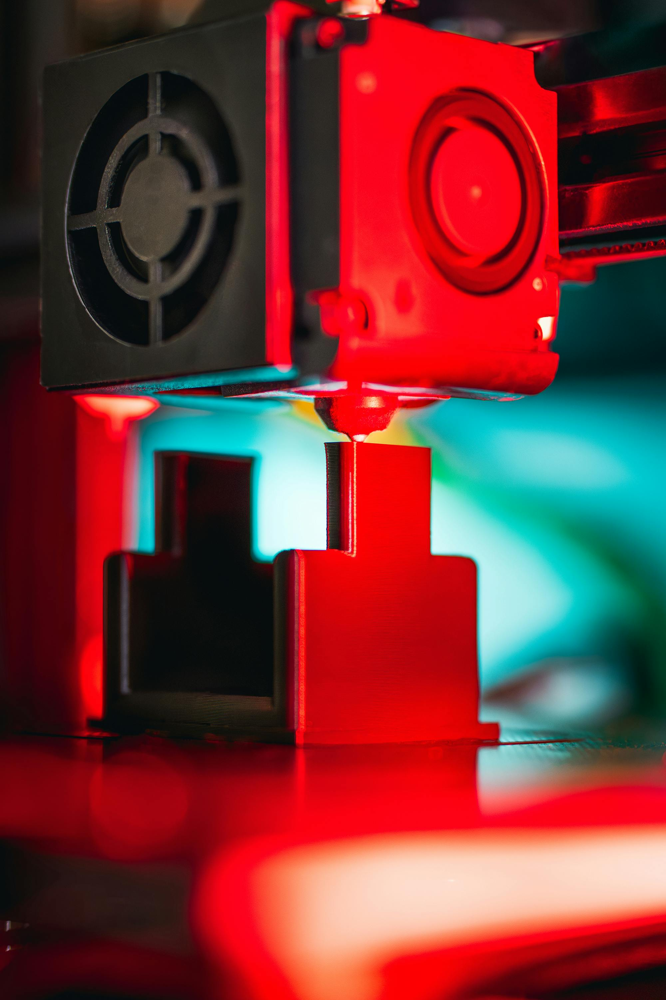

# All-Metal Hotend Upgrade

> When and why to replace your PTFE-lined hotend with an all-metal version.

---

## Overview

Most budget printers come with a PTFE-lined hotend — a PTFE (Teflon) tube runs all the way through the heatbreak to the nozzle. This works well for low-temp materials but becomes a serious limitation above 240°C, where PTFE degrades, off-gasses, and can cause jams.

An all-metal hotend replaces the PTFE-lined heatbreak with a metal one, allowing printing at temperatures up to 300–400°C+ depending on the design.

---

## PTFE-Lined vs All-Metal

| Property | PTFE-Lined | All-Metal |
|---|---|---|
| Max safe temp | ~240°C | 300–500°C+ |
| Material range | PLA, PETG, TPU | All materials incl. ABS, Nylon, PC, PEEK |
| Retraction | Forgiving | Requires more precise tuning |
| Clog risk | Lower (PTFE is non-stick) | Slightly higher with soft materials |
| Cost | Lower | Higher |
| Maintenance | PTFE tube needs periodic replacement | Longer service life |

---

## When You Need an All-Metal Hotend

**Upgrade if you want to print any of:**
- ABS at high temperatures (250°C+)
- Nylon (240–270°C)
- Polycarbonate (260–310°C)
- PEI / Ultem (340–380°C)
- PEEK (360–400°C)
- CF/GF composites at sustained high temps

**You do NOT need to upgrade for:**
- PLA (prints at 180–220°C)
- PETG (prints at 230–250°C — borderline, but usually fine)
- TPU (prints at 220–240°C)

---

## Popular All-Metal Hotend Options

| Hotend | Max Temp | Notes |
|---|---|---|
| **E3D V6 All-Metal** | 300°C | The original — widely supported, huge ecosystem |
| **E3D Revo** | 300°C | Tool-free nozzle changes, excellent quality |
| **Phaetus Dragon HF** | 300°C | Excellent flow rate, popular on Voron and custom builds |
| **Slice Engineering Mosquito** | 500°C | High-temp specialist, used for PEEK/PEI |
| **Phaetus Rapido** | 300°C | Very high flow — great for speed printing |
| **Bambu Hotend** | 300°C | Proprietary to Bambu printers, excellent performance |

---

## Heat Creep — The All-Metal Trade-Off

All-metal hotends are more prone to **heat creep** — where heat migrates up the heatbreak into the cold zone, softening filament before it should and causing jams. PTFE is an excellent insulator that naturally prevents this in lined hotends.

How to manage heat creep with all-metal:

- Ensure the **heatsink fan runs at full speed at all times** during printing
- Use a **silicone sock** on the heater block — reduces radiated heat
- Print at the **lowest temperature that gives good results**
- Avoid very slow print speeds with high temps — filament spends too long in the hot zone
- Use a **quality all-metal hotend** with a proper heatbreak geometry — cheap copies often have poor heat breaks

*All-metal hotend assembly — the heatsink and fan are critical for preventing heat creep.*

---

## Installation Notes

- All-metal hotends generally require **recalibration of retraction** — the reduced friction means less retraction is needed than with PTFE
- Re-run [Retraction Calibration](../tuning/Retraction-Calibration.md) after any hotend change
- Check that your printer can reach the required temperature — some stock boards have thermistor limits in firmware
- For PEEK and PEI, you will also need a **high-temp thermistor** (PT100 or PT1000) — standard NTC thermistors are not rated above 280–300°C

---

*Back to [Hardware Guides](../README.md#️-hardware-guides) | [README](../README.md)*