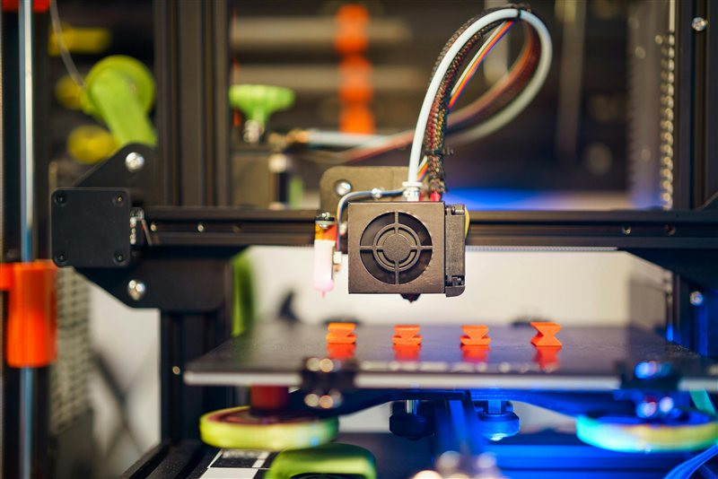
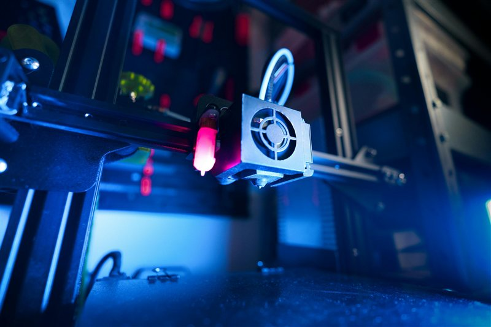

# Enclosure Guide

> Why you need one, what chamber temp to target, and how to build or buy one.

---

## Overview

An enclosure surrounds the printer to trap heat, creating a warm, draught-free environment. For engineering materials (ABS, ASA, Nylon, PC) it is not optional — without one, thermal stress causes warping and layer delamination regardless of other settings.

---

## Do You Need an Enclosure?

| Material | Enclosure Needed | Target Chamber Temp |
|---|---|---|
| PLA | No | Ambient |
| PETG | No (benefits from draught-free) | Ambient |
| ABS | **Yes** | 45–50°C |
| ASA | **Yes** | 45–50°C |
| TPU | No | Ambient |
| Nylon | Recommended | Ambient (draught-free) |
| PC | **Yes** | 50–60°C |
| PEI / Ultem | **Yes** | 120–160°C |
| PEEK | **Yes** | 120–140°C |

---

## Passive Enclosure (No Active Heating)

A passive enclosure simply traps the heat generated by the heated bed and motors. This is sufficient for ABS, ASA, and Nylon.

**DIY Options:**
- **Cardboard box** — the budget solution. Surprisingly effective for ABS. Not fireproof — supervise prints.
- **IKEA Lack table stack** — the classic DIY enclosure. Two Lack tables stacked create a 33 cm tall enclosed space. Add panels (acrylic, foam board, coroplast) and magnetic door seals.
- **Custom plywood or aluminium extrusion build** — more rigid, better insulation, good for long-term use.

**Commercially Available:**
- **Bambu Lab AMS/P1 enclosure** — designed for Bambu printers
- **Creality Ender 3/5 enclosure** — purpose-built for Ender series printers
- **Generic printer tent enclosures** — cheap, basic, fine for ABS/ASA

*The Lack enclosure — two IKEA Lack tables with acrylic side panels and a magnetic front door.*

---

## Active Heating (For PC, PEI, PEEK)

PEEK and PEI require chamber temperatures of 120°C+, which cannot be achieved by bed heat alone. Active heating requires:

- An **insulated enclosure** (double-wall or foam insulation)
- A **chamber heater** — PTC ceramic heaters are common, or repurposed heater cores
- A **chamber thermistor** wired to the printer board or a separate controller
- **High-temp electronics relocation** — steppers and boards must be outside the heated chamber or rated for the temps

> ⚠️ Standard printer electronics, stepper motors, and wiring are not rated for 120°C+ ambient temperatures. Moving electronics outside the chamber is required for high-temp printing.

**Printers with Active Chamber Heating:**
- Bambu X1 (passive only — ~45°C max)
- Voron 2.4 (passive — typically 60°C+ with hot bed)
- Apium P220, AON3D AON-M2 (active — rated for PEI/PEEK)
- RatRig V-Core with chamber heater mod

*Actively heated enclosure — insulated walls, chamber heater, and external electronics box.*

---

## Ventilation and Filtration

Enclosures concentrate fumes — especially important for ABS, ASA, and engineering materials:

| Material | Fume Risk | Filtration Needed |
|---|---|---|
| PLA | Low | Optional |
| PETG | Low-Medium | Optional but recommended |
| ABS | **High (styrene)** | **HEPA + activated carbon required** |
| ASA | Medium | HEPA + activated carbon recommended |
| Nylon | Medium | HEPA + activated carbon recommended |
| CF Composites | **High (fine particles)** | **HEPA required** |

**Filtration Options:**
- **Nevermore Micro/StealthBurner filter** — activated carbon recirculating filter, popular on Voron builds
- **HEPA + carbon filter units** — inline exhaust filters
- **External venting** — duct enclosure exhaust outside the building (simplest for ABS)

---

## Tips

- **Seal gaps** — even small gaps let warm air escape and cold air in. Foam tape and magnetic seals work well.
- **Pre-heat the chamber** for 15–30 minutes before printing engineering materials — let the enclosure reach steady-state temperature.
- **Acrylic panels yellow over time** with ABS fumes — polycarbonate sheet is more resistant.
- Keep **electronics outside** or well-ventilated even in passive enclosures — elevated ambient temps reduce stepper and board lifespan.

---

*Back to [Hardware](../README.md#hardware) | [README](../README.md)*