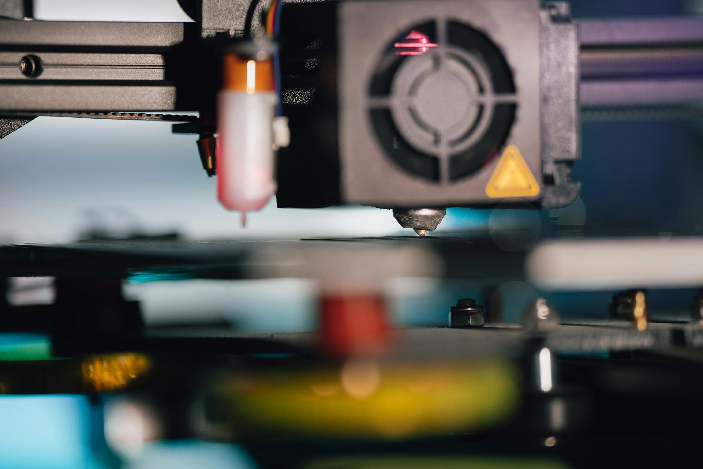

# Nozzle Guide

> Choose the right nozzle material and size, and know when and how to change it.

---

## Overview

The nozzle is a consumable component. Choosing the correct material prevents premature wear, and knowing the right size for your use case improves both print quality and speed.

---

## Nozzle Materials

| Material | Durability | Thermal Conductivity | Best For | Avoid With |
|---|---|---|---|---|
| **Brass** | Low (wears fast with abrasives) | Excellent | PLA, PETG, ABS, ASA, TPU | CF, GF, glow-in-dark |
| **Hardened Steel** | High | Good | All materials incl. CF/GF composites | Nothing — good all-rounder |
| **Stainless Steel** | Medium | Poor | Food-safe applications | High-speed printing |
| **Ruby-Tipped** | Extreme | Excellent (brass body) | CF/GF composites, PEEK, abrasive filaments | Budget-conscious builds |
| **Tungsten Carbide** | Extreme | Moderate | Industrial abrasive materials | Most desktop printers |

### Key Rule
> **Never print CF, GF, or glow-in-dark filaments with a brass nozzle.** These are abrasive and will wear a brass nozzle within 200–500 g of filament. Switch to hardened steel as a minimum.

---

## Nozzle Sizes

| Size | Best For | Trade-off |
|---|---|---|
| 0.2 mm | Ultra-fine detail, miniatures | Very slow, clogs easily, not for CF |
| 0.4 mm | General purpose — the default | Best balance of speed and detail |
| 0.6 mm | Functional parts, CF composites, faster prints | Less fine detail |
| 0.8 mm | Rapid prototyping, large parts | Coarse detail |
| 1.0 mm | Large structural parts, max speed | Minimal detail |

**For CF/GF composites, 0.6 mm is often the sweet spot** — large enough to pass fibres without restriction, still reasonable detail.

---

## When to Replace

| Sign | Action |
|---|---|
| Nozzle tip is visibly worn flat or deformed | Replace |
| Under-extrusion that persists after cold pull | Replace |
| Diameter of extruded filament is inconsistent | Replace |
| Brass nozzle used with CF/GF > 500 g | Replace |
| Changed material family (e.g. CF to food-safe) | Replace |

As a general rule: **replace brass nozzles every 3–6 months** of regular printing. Hardened steel lasts much longer — often 1–2 years.

---

## How to Change a Nozzle

> ⚠️ Always change nozzles at **printing temperature** — cold removal strips or damages threads.

### What You Need
- Correct replacement nozzle (match thread pitch for your hotend — E3D M6, V6, Volcano, Bambu, etc.)
- Nozzle spanner or 7 mm socket
- Pliers or block spanner to hold the heater block
- Heat-resistant gloves

### Steps

1. Heat the hotend to printing temperature (200°C for PLA, higher for other materials)
2. **Hold the heater block steady** with pliers — never let it rotate or you will break heater/thermistor wires
3. Use the nozzle spanner to loosen the nozzle — counter-clockwise
4. Remove the old nozzle carefully — it is very hot
5. Thread the new nozzle in by hand first to avoid cross-threading
6. Tighten firmly with the spanner — do not overtighten, but it must be snug against the heatbreak
7. Allow to cool then re-tighten (metal contracts slightly when cooling — a common source of leaks)

*Always change at temperature — hold the heater block steady, not the hotend body.*

---

## Popular Nozzle Brands

- **E3D** — industry standard, excellent quality, wide range of sizes and materials
- **Bondtech** — high quality, good hardened steel range
- **Slice Engineering** — Copperhead and Vanadium nozzles for high-temp work
- **Bambu Lab** — proprietary sizing for Bambu printers
- **3D Solex** — matchless nozzles, long-life options

---

*Back to [Hardware](../README.md#hardware) | [README](../README.md)*