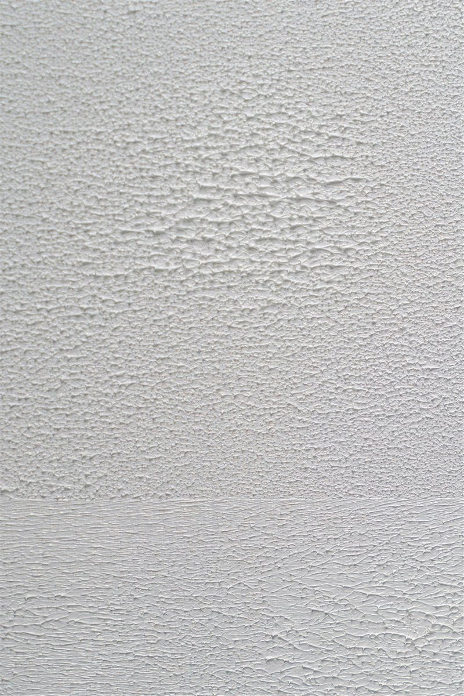
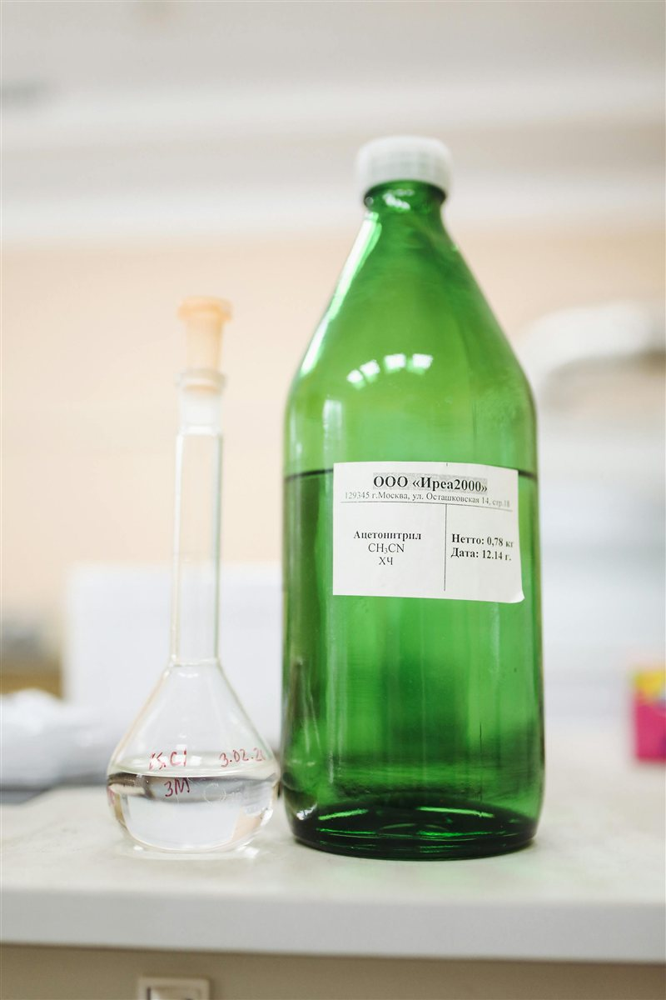
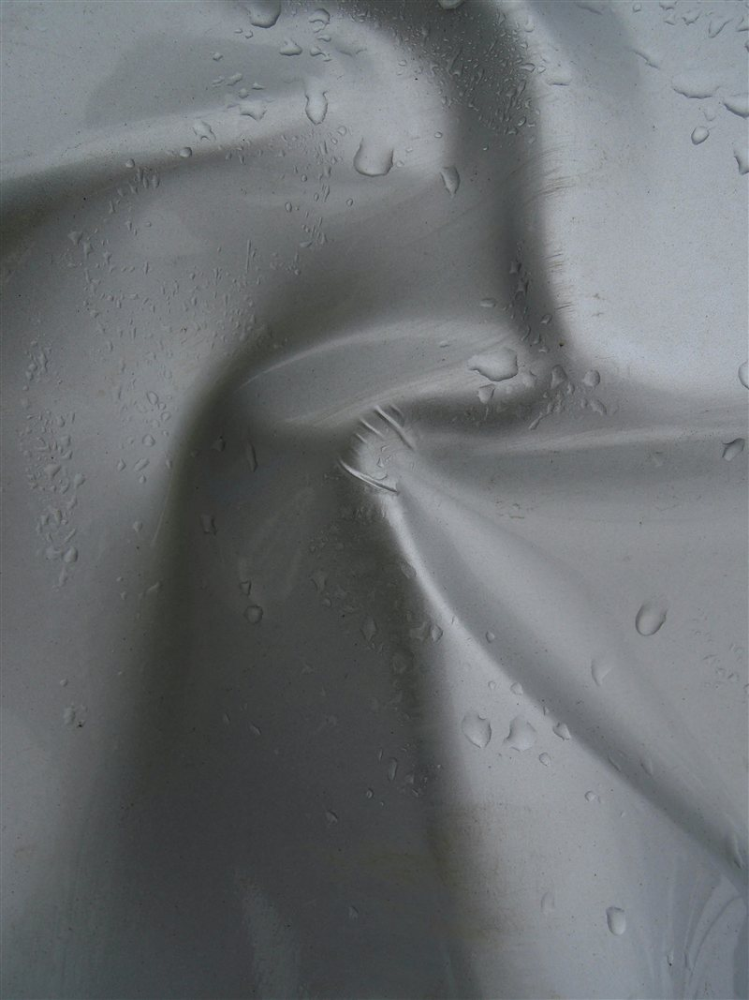

# Acetone Vapour Smoothing

> Chemically smooth ABS and ASA prints to a near-injection-moulded finish.

---

## Overview

Acetone vapour dissolves the surface of ABS and ASA prints, allowing the outermost layer to reflow and self-level. The result is a smooth, glossy surface with layer lines completely eliminated — no sanding required. This only works on **ABS and ASA** — acetone does not affect PLA, PETG, or other common filaments.

*Left: raw FDM ABS print. Right: same print after acetone vapour smoothing — layer lines gone.*

---

## Safety — Read First

> ⚠️ **Acetone is highly flammable.** It has a very low flash point (-20°C). Never heat acetone directly or use near open flames, sparks, or hot surfaces.

- Work **outdoors or in a very well-ventilated area** — vapour accumulates quickly
- **No open flames** — no smoking, no gas hobs, no pilot lights nearby
- Use **nitrile gloves** — acetone strips oils from skin and degrades latex gloves
- Store acetone in its original container away from heat sources

---

## What You Need

- Acetone (100% pure — nail polish remover works but is slower)
- A metal or glass container with a lid (no plastic — acetone dissolves most plastics)
- A small metal or glass platform (to keep the print above the liquid)
- ABS or ASA print — cleaned and dry

---

## Method 1 — Cold Vapour (Recommended)

1. Pour a small amount of acetone (10–20 ml) into the bottom of the container — enough to wet the base, not submerge the platform.
2. Place the print on the platform above the liquid.
3. Seal the container with the lid.
4. Leave for **5–20 minutes** — check every 5 minutes. Time varies by print size and detail level.
5. Remove the print and place on a clean surface to dry for **30–60 minutes** — the surface is soft and easily damaged while wet.
6. Do not touch the surface until fully cured.

*Cold vapour setup — print sits above the acetone on a raised platform inside a sealed container.*

*After 10 minutes — the surface has smoothed and developed a gloss. Remove before over-exposure.*

---

## Method 2 — Direct Wipe (Faster, Less Uniform)

For quick smoothing of specific areas:
1. Dip a small brush or cotton bud in acetone
2. Lightly wipe the surface — one pass only
3. Allow to dry before handling

This gives less uniform results than vapour but is faster and more controllable for detail areas.

---

## Timing Guide

| Exposure Time | Effect |
|---|---|
| 5 minutes | Light smoothing, some layer lines remain |
| 10–15 minutes | Most layer lines gone, good gloss |
| 20–30 minutes | Full smooth, may lose fine details |
| 30+ minutes | Over-exposure — print becomes soft, details lost, distortion risk |

> **Less is more.** You can always re-expose — you cannot undo over-exposure.

---

## Tips

- Print with **0% cooling fan** for ABS intended for smoothing — better layer adhesion means a stronger final part after smoothing.
- Fine details (text, sharp edges) will soften — avoid smoothing highly detailed parts.
- After smoothing, ABS/ASA can be **painted or primed** immediately once cured — the surface takes paint exceptionally well.
- Acetone-smoothed parts are often **stronger** than unsmoothed — the surface reflow improves layer bonding.
- A small **ultrasonic humidifier** filled with acetone (outdoors only) can produce a very fine, even vapour for large parts.

---

*Back to [Post-Processing](../README.md#post-processing) | [README](../README.md)*