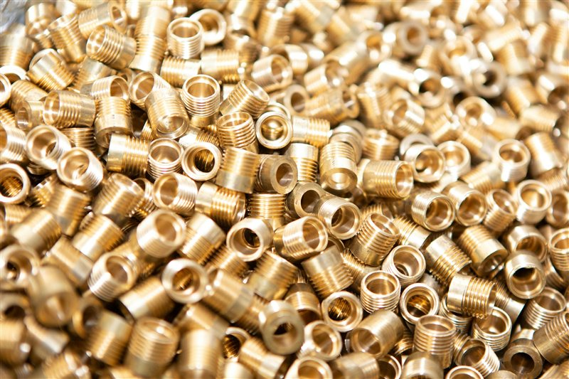
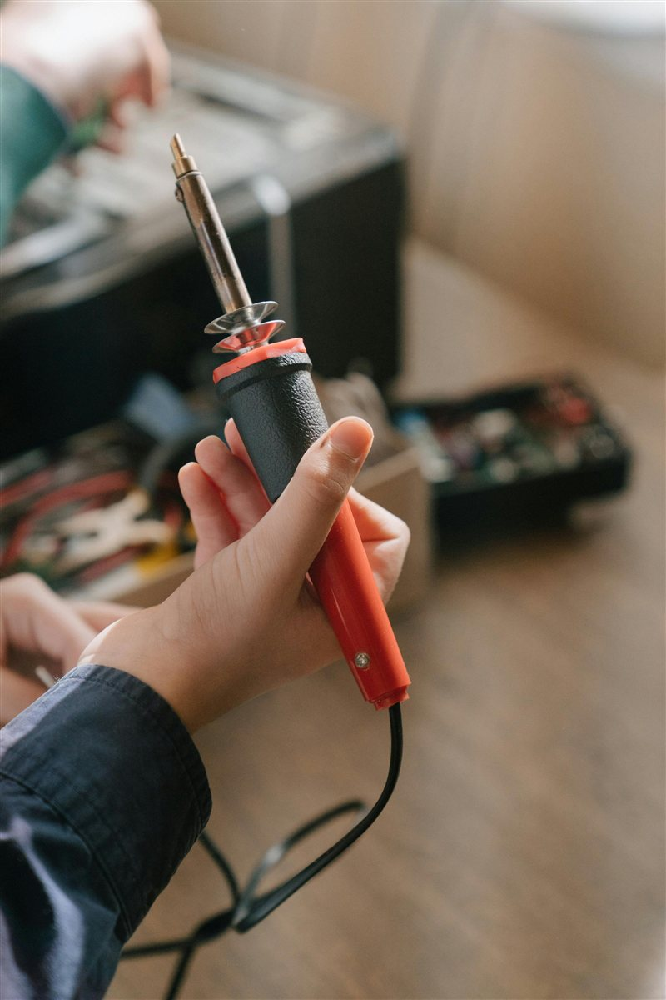
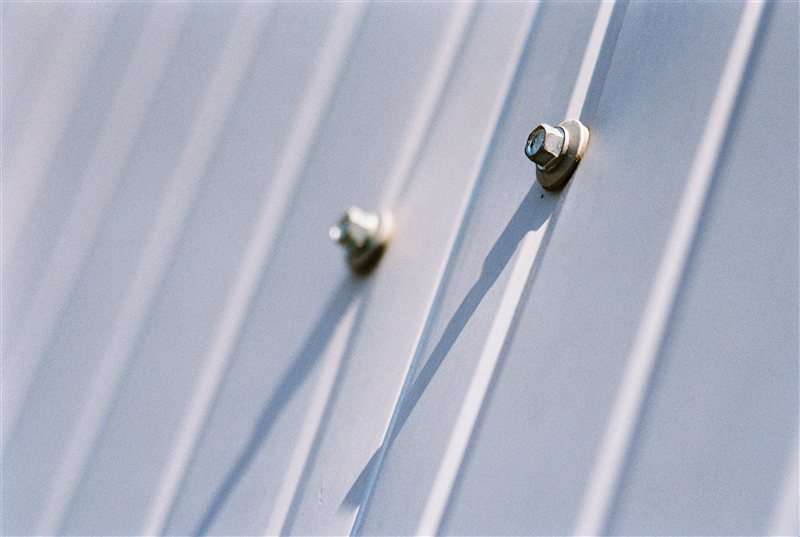

# Heat-Set Inserts

> Add strong, reusable threaded connections to your 3D prints.

---

## Overview

Heat-set inserts (also called heat-set nuts or threaded inserts) are brass threaded inserts pressed into a 3D printed hole using heat. As they cool, the surrounding plastic solidifies around the knurled exterior, locking the insert in place. The result is a metal-threaded connection that can be assembled and disassembled many times without stripping — far stronger than threading directly into plastic.

*Heat-set inserts installed in a PLA part — brass inserts flush with the surface, ready for M3 screws.*

---

## Why Use Heat-Set Inserts

- **Reusable** — assemble and disassemble many times without degrading the thread
- **Stronger than plastic threads** — especially important for PLA and PETG which are brittle
- **Pull-out resistance** — the knurled exterior grips the surrounding plastic in all directions
- **Professional result** — looks and functions like an injection-moulded part

---

## What You Need

- Heat-set inserts (M2, M3, M4, or M5 — match your screw size)
- Soldering iron with a flat or insert-specific tip (temperature-controlled preferred)
- A flat surface to press against
- The 3D printed part with correctly sized holes

---

## Hole Sizing

The hole in the print should be slightly **smaller than the insert outer diameter** so the insert displaces material as it goes in.

| Insert Size | Recommended Hole Diameter |
|---|---|
| M2 | 3.2 mm |
| M3 | 4.2 mm |
| M4 | 5.6 mm |
| M5 | 6.4 mm |

> These are typical values for standard Ruthex/CNC Kitchen-style inserts. Check your insert supplier's datasheet — dimensions vary slightly between brands.

**Hole depth** should equal insert length plus 0.5–1 mm to allow for any plastic squeeze-out.

---

## Step 1 — Set Iron Temperature

Temperature depends on material:

| Material | Iron Temperature |
|---|---|
| PLA | 180–200°C |
| PETG | 200–220°C |
| ABS / ASA | 220–240°C |
| Nylon | 230–250°C |
| PC | 240–260°C |

Too hot = the plastic melts too far back and the insert sinks in crooked. Too cold = the insert won't go in smoothly and the plastic tears rather than flows.

---

## Step 2 — Install the Insert

1. Place the insert on the hole opening, flat side down
2. Press the soldering iron tip onto the top of the insert — do not force it
3. Apply **light, steady downward pressure** — let the heat do the work
4. The insert will slowly sink into the hole as the surrounding plastic softens
5. Stop when the insert is **flush with or just below the surface** — 0.1–0.2 mm below is ideal
6. Remove the iron and hold the insert still for **5–10 seconds** while it cools
7. Do not disturb until the plastic has fully re-solidified

*Light pressure with the iron — let the heat do the work. Flush or just below the surface is the target.*

*Correctly installed — flush with the surface, straight, no visible tearing or burning of surrounding material.*

---

## Common Mistakes

| Mistake | Result | Fix |
|---|---|---|
| Too much pressure | Insert goes crooked | Slow down, use less force, let heat do the work |
| Iron too hot | Plastic burns and discolours | Lower temp, work faster |
| Iron too cold | Insert tears in rather than flows | Increase temp by 10°C |
| Hole too large | Insert spins freely | Reprint with smaller hole |
| Hole too small | Insert won't seat flush | Increase hole diameter by 0.1 mm |

---

## Tips

- A **dedicated insert tip** for your soldering iron gives much better control than a flat tip — worth the investment if you install inserts regularly.
- For PLA parts, **anneal the part at 60°C for 30 minutes** before installing inserts — this relieves print stresses and reduces cracking.
- **Test on a spare piece** of the same material and settings before installing in your final part.
- Install inserts from the **back side** of the hole when possible — any minor surface disturbance is hidden.
- Ruthex and CNC Kitchen inserts are popular quality brands with good documentation.

---

*Back to [Post-Processing](../README.md#post-processing) | [README](../README.md)*