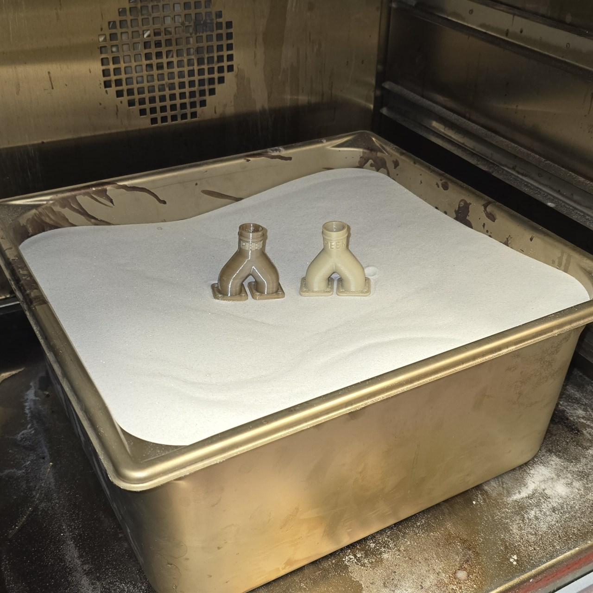
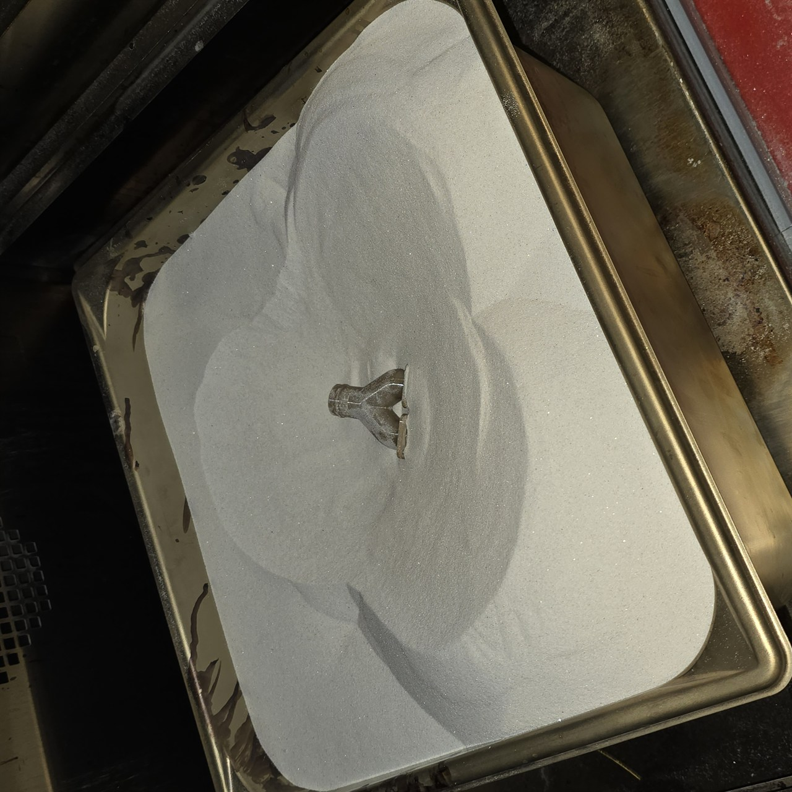
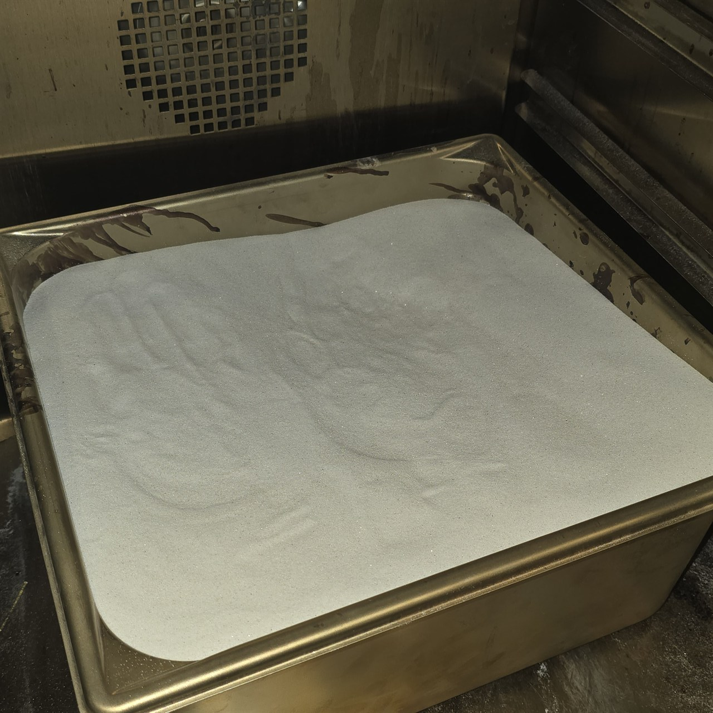
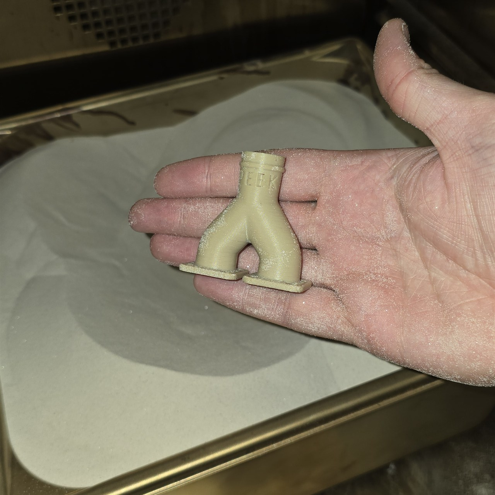
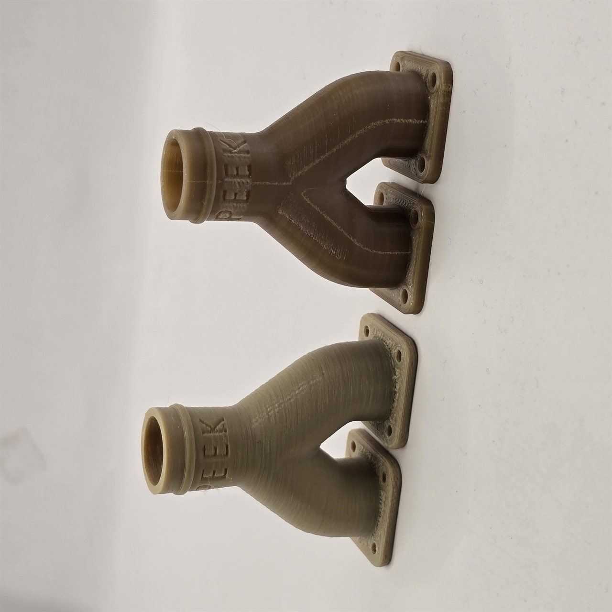

# PEEK Annealing

> Annealing transforms a printed PEEK part from a strong, amorphous structure into a fully semi-crystalline component with dramatically improved heat resistance, stiffness, and long-term dimensional stability. Done correctly, it is one of the most impactful post-processing steps available for high-performance engineering parts.

---

## Why Anneal PEEK?

When PEEK is printed, it cools rapidly after deposition. This rapid cooling locks the polymer chains in a partially amorphous state — the part is strong, but it has not reached the full crystallinity that PEEK is capable of.

Annealing holds the part at a controlled elevated temperature for an extended period, giving the polymer chains time to reorganise into a semi-crystalline structure. The difference in performance is significant:

| Property | As-Printed (Amorphous) | After Annealing (Semi-Crystalline) |
|---|---|---|
| Heat Deflection Temp | ~140°C | **250°C+** |
| Tensile Strength | ~90 MPa | **~120 MPa (~33% increase)** |
| Young's Modulus | ~3.6 GPa | ~4.5 GPa |
| Long-term Creep Resistance | Moderate | Excellent |
| Chemical Resistance | Excellent | Outstanding |
| Dimensional Change | Baseline | **< 1% shrinkage** |

> 💡 If your PEEK part will be exposed to temperatures above 100°C, operating under sustained load, or immersed in aggressive chemicals — annealing is not optional. It is the step that makes PEEK what it is.

---

## The Sand Burial Method

The biggest challenge with annealing PEEK is warping. As the part heats and the polymer chains relax, internal stresses from printing are released — and without external support, this can cause significant distortion, particularly on flat faces, thin walls, and long spans.

The solution is **sand burial** — embedding the part fully in fine quartz sand before annealing. The sand:
- Provides uniform, gentle pressure on all surfaces simultaneously
- Transfers heat evenly to the entire part without hotspots
- Prevents distortion as the polymer relaxes by holding geometry in place
- Allows controlled, even cooling when the oven is switched off

The sand used must be **refined quartz sand, 0.1mm grain size**. Coarser sand can leave surface impressions. Play sand and building sand contain impurities and inconsistent grain size — do not use them.

---

## What You Need

- Convection oven or laboratory furnace with accurate temperature control
- **Refined quartz sand — 0.1mm grain size** (sufficient to fully bury the part with margin on all sides)
- A metal container or baking tray with tall sides — deep enough to bury the part with at least 20–30mm of sand above it
- Digital thermometer or oven probe to verify actual chamber temperature
- Heat-resistant gloves

---

## Step-by-Step Process

### Step 1 — Prepare the Part

- Remove all support material fully before annealing — supports cannot be removed cleanly after crystallisation
- Clean the part of any loose debris or contamination
- If the part has critical mating faces or tolerances, measure it before annealing — expect 0.1–0.5% shrinkage, predominantly in the Z axis

---

### Step 2 — Prepare the Sand Bed

*Both the unannealed part (left) and a previously annealed reference part (right) shown inside the oven before the sand burial process begins. Note the colour difference — the annealed part has a slightly more opaque, crystalline appearance.*

Pour a base layer of quartz sand into your metal container — at least 30mm deep. Level it off. This forms the support bed the part will sit on.

---

### Step 3 — Bury the Part

*A deep hole pressed into the quartz sand to seat the part. The cavity should conform closely to the part geometry with no unsupported overhangs — every surface that could distort must be supported by sand.*

Press a cavity into the sand that matches the part's geometry. Lower the part in carefully and ensure it is seated level. Then pour sand slowly over and around the part, working from the sides inward to avoid displacing it. Continue until the part is covered by at least 20–30mm of sand above its highest point.

---

### Step 4 — Compress and Level

*The part is fully buried and the sand has been gently compressed by hand to remove air pockets. A flat, level sand surface indicates even coverage. The container is now ready to go into the oven.*

Gently compress the sand by pressing down evenly with your palm — this removes air pockets and ensures the sand is in full contact with all part surfaces. Level the top surface. Do not over-compress — firm even contact is all that is needed.

---

### Step 5 — Anneal

Place the container into a **cold oven**. Do not place it into a pre-heated oven — a sudden thermal shock can cause immediate warping before the sand has a chance to provide support.

**Annealing cycle:**

| Stage | Temperature | Duration | Notes |
|---|---|---|---|
| Stage 1 — Low hold | 100°C | **3 hours** | Initial soak — drives out residual moisture and relieves print stresses gradually before the high-temp stage |
| Stage 2 — Anneal hold | 200°C | **5 hours** | Full crystallisation hold — allows the polymer chains to fully reorganise throughout the entire part, not just the outer surface |
| Cool down | 200°C → ambient | **24 hours — oven off, door closed** | Slow, controlled cool — critical for locking in crystallinity and preventing warp |

> ⚠️ **Do not skip Stage 1.** The 100°C pre-soak is not just drying — it allows internal stresses from printing to relax gradually before the material reaches the crystallisation temperature. Going straight to 200°C risks surface crystallisation before the core is ready, creating internal stress gradients.

> ⚠️ **The 5-hour hold at 200°C is the minimum for thorough crystallisation.** Shorter holds may crystallise the surface while the core remains partially amorphous — reducing the benefit of the process.

> ⚠️ **The 24-hour cool-down is not optional.** Cooling too fast re-introduces internal stresses and can partially reverse crystallinity gains. The sand mass and closed oven combine to produce a slow, even descent to room temperature — this is what locks the structure in place.

---

### Step 6 — Cool Down — Do Not Rush This

The cooling phase is just as important as the annealing hold. Rapid cooling quenches the crystalline structure and can reintroduce internal stresses, partially reversing the annealing benefit and causing warping as the part contracts unevenly.

**Correct procedure:**
1. When the 200°C hold is complete, switch the oven off
2. **Leave the door fully closed** — do not open it under any circumstances
3. Allow the oven and sand mass to cool for a full **24 hours** before opening
4. After 24 hours, open the oven door and allow a brief final equilibration to room temperature before removing the container
5. Unbury the part carefully from the sand

> 💡 The large thermal mass of the sand is a significant advantage during the 24-hour cool-down — it acts as a buffer that sustains heat and slows the rate of temperature loss, keeping the part descending evenly on all sides. Opening the oven door early introduces a sudden drop in ambient temperature around the part that the sand cannot compensate for — this is the most common cause of warp in otherwise correctly annealed parts.

---

### Step 7 — Inspect

*The part being uncovered from the quartz sand after the annealing cycle and full cool-down. The sand brushes away cleanly from the surface. No distortion is visible — the geometry has been held true throughout.*

Brush the sand away and inspect the part. A successfully annealed PEEK part will often have a slightly more opaque, matte surface finish compared to the as-printed state — this is normal and is a visible indicator of crystallinity. The part may also feel slightly different in the hand — denser, more rigid.

Check critical dimensions if tolerances are important. Shrinkage is less than 1% — primarily in the Z axis. Design-in a small allowance if annealed parts need to hit tight tolerances. The reward for this process is a genuine ~33% increase in part strength and a heat deflection temperature that climbs from ~140°C to over 250°C.

---

## Annealed vs Unannealed — Side by Side

*Detailed side-by-side comparison of unannealed (left) and annealed (right) PEEK parts, photographed in a light box to reveal surface and structural differences. The annealed part shows a slightly more opaque finish and improved surface uniformity — the result of the polymer achieving its semi-crystalline state.*

---

## Common Problems

| Problem | Likely Cause | Fix |
|---|---|---|
| Part warped after annealing | Ramp too fast, sand not fully compacted, or cooling too rapid | Slow the ramp to 2°C/min, compress sand more thoroughly, ensure oven cools with door closed |
| Surface impressions from sand | Sand grain too coarse | Switch to 0.1mm refined quartz sand only |
| Part cracked during ramp | Thermal shock from placing in hot oven | Always start in a cold oven and ramp slowly |
| Part still soft above 140°C after annealing | Insufficient hold time or temperature too low | Extend hold to 3–4 hours at 200°C |
| Dimensional change too large | Normal annealing shrinkage | Expect < 1% shrinkage — primarily Z-axis. Design with a small allowance on critical fits |
| Surface discolouration / yellowing | Oven temperature exceeded 220°C | Verify oven temperature with a probe — calibrate or adjust set point |

---

## Tips

- **Verify your oven temperature** — consumer ovens can run 10–20°C hotter than their dial setting. Use an independent probe to confirm the actual chamber temperature before committing a finished part to the cycle.
- **Use a metal container with tall sides** — a standard baking tray is too shallow. A deep metal loaf tin or steel container gives you room to bury the part with adequate sand coverage above.
- **Anneal before final machining** — if you plan to drill, tap, or machine the part, anneal first. Dimensional changes after machining are much harder to account for.
- **Do not anneal parts with metal inserts already installed** — differential thermal expansion between PEEK and the insert can crack the part or distort the insert bore. Install inserts after annealing.
- **Label your container** — if you have multiple annealing runs in progress, mark the container with what's inside. Sand looks the same whether there's a part in it or not.

---

*Back to [Post-Processing Guides](../README.md#-post-processing-guides) | [README](../README.md)*
