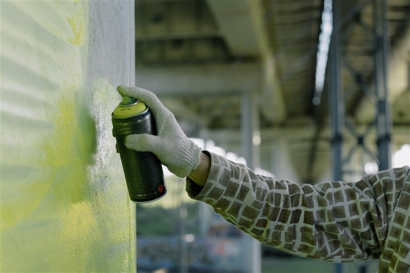

# Painting 3D Prints

> Prime, paint, and finish your prints to a professional standard.

---

## Overview

Painting dramatically improves the appearance of 3D prints and can make FDM parts indistinguishable from injection-moulded pieces. The keys are proper surface preparation, the right primer, and thin coats.

---

## Material Compatibility

| Material | Paintability | Notes |
|---|---|---|
| PLA | Excellent | Takes most paints well after priming |
| PETG | Good | Slightly flexible — use flexible primer for best adhesion |
| ABS / ASA | Excellent | Can be acetone-smoothed first for best results |
| TPU | Challenging | Needs flexible paint — standard paint cracks when flexed |
| Nylon | Moderate | Needs adhesion promoter primer |
| CF Composites | Good | Matte surface takes paint well — prime first |

---

## Step 1 — Surface Preparation

Paint only sticks as well as the surface beneath it. Preparation is everything:

1. Remove any support scars with a craft knife or file
2. Sand with 220 grit to scuff the surface (gives paint something to grip)
3. Wipe with IPA to remove all dust, oils, and release agents
4. Allow to dry completely before priming

For the best results, sand progressively to 400 grit — see [Sanding and Finishing](Sanding-Finishing.md).

---

## Step 2 — Prime

Primer is non-optional. It provides adhesion, fills remaining surface texture, and gives a consistent base colour.

| Primer Type | Best For |
|---|---|
| **Filler primer (grey)** | General purpose — fills layer lines |
| **White primer** | Before light colours — prevents colour bleed-through |
| **Flexible primer** | PETG, TPU — prevents cracking on flex |
| **Adhesion promoter** | Nylon, PP — materials that repel standard paint |

- Apply **2–3 light coats**, allowing each to dry fully (20–30 min between coats)
- Sand lightly with 400 grit between coats for ultra-smooth results
- Inspect under a light — any remaining layer lines will show as shadows

*Fully primed print — uniform surface, no bare plastic showing.*

---

## Step 3 — Base Coat

Apply your colour in thin coats:

- Hold can **25–30 cm** from the surface
- Use **sweeping passes** — never stop moving while spraying
- **Thin coats only** — thick coats run, drip, and obscure detail
- Allow each coat to dry fully before the next (30 min minimum)
- 2–3 thin coats typically gives full coverage

*First colour coat — thin and even. Some primer may still show through — this is fine at this stage.*

---

## Step 4 — Detail Painting (Optional)

For multi-colour or detail work:

- Use **Vallejo, Citadel, or similar hobby acrylic paints** — these are formulated for detail work and dry fast
- Apply with **fine brushes** — size 0 or 00 for detail, size 2 for larger areas
- Thin paint with water to the consistency of skimmed milk for smooth brush application
- Use masking tape for clean hard edges between colours

---

## Step 5 — Clear Coat

A clear coat protects the paint and gives a consistent sheen:

| Finish | Use Case |
|---|---|
| **Matte clear coat** | Natural, non-reflective look — good for most models |
| **Satin clear coat** | Subtle sheen — good for mechanical or prop pieces |
| **Gloss clear coat** | High shine — good for display pieces, vehicles |

- Apply 2 light coats
- Final coat can be lightly buffed with 2000 grit for extra smoothness

---

## Tips

- **Temperature matters** — spray paint in 15–25°C, 40–60% humidity. Cold or humid air causes bloom, runs, and poor adhesion.
- **Rattle cans vs airbrush**: rattle cans are convenient for basecoats; an airbrush gives far more control for detail work.
- **Enamel vs acrylic**: acrylics are safer, faster-drying, and clean up with water. Enamels are more durable but need solvents for cleanup.
- Let prints **fully cure** (24–48 hrs) after clear coat before handling — the surface is soft while drying.

---

*Back to [Post-Processing Guides](../README.md#-post-processing-guides) | [README](../README.md)*