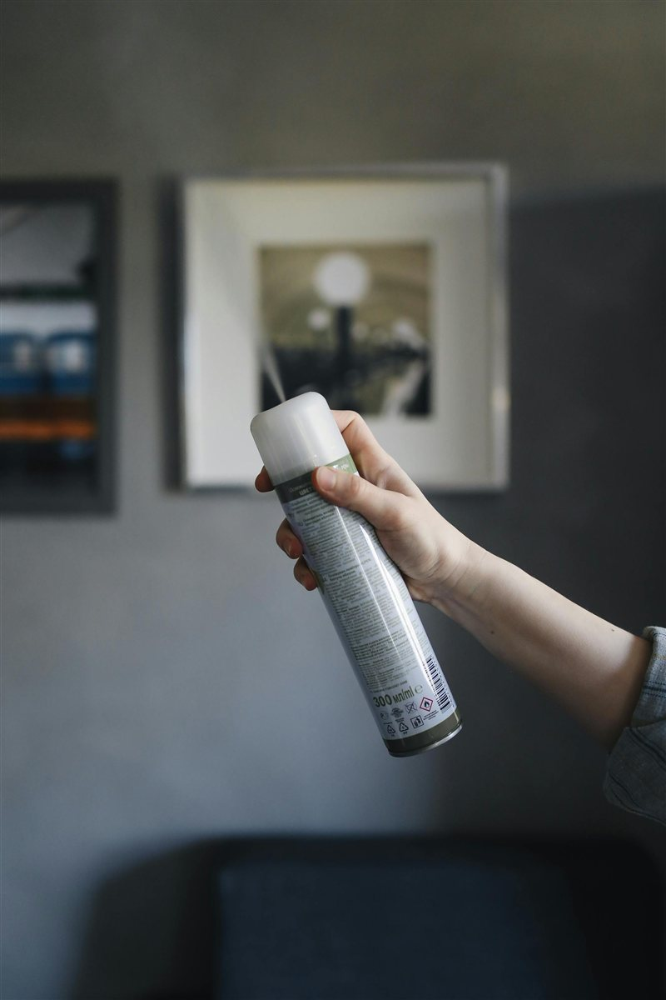
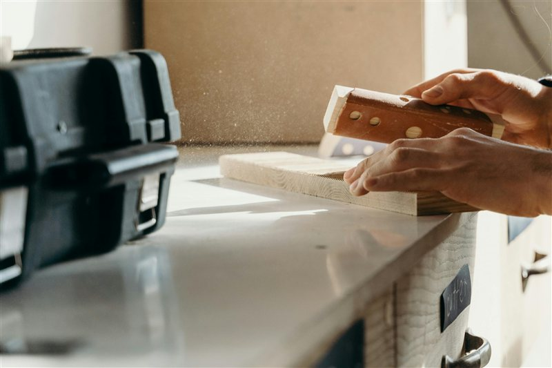
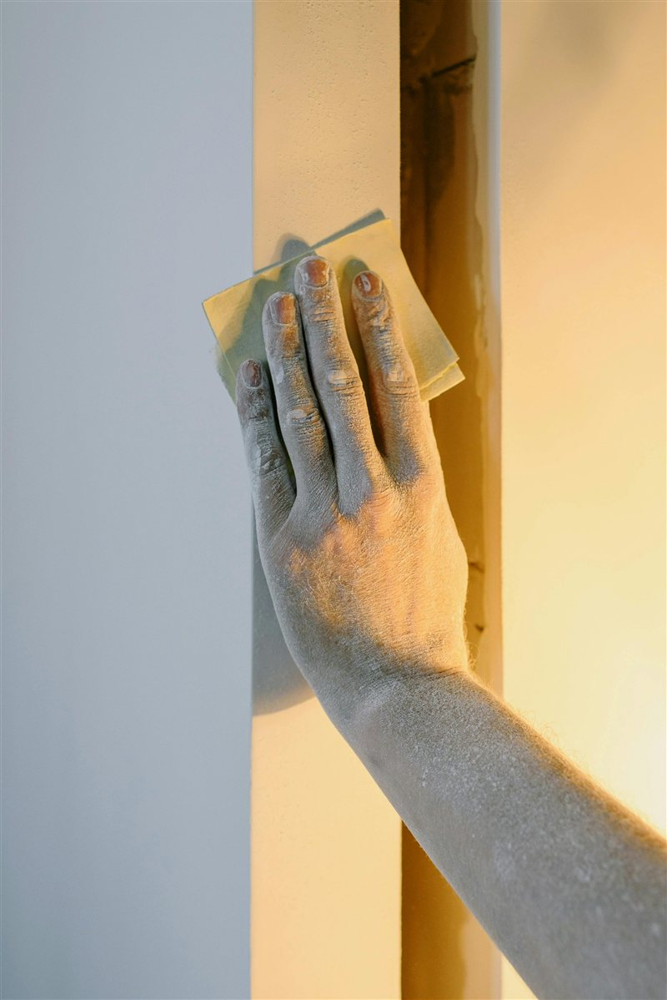

# Sanding and Finishing

> Achieve smooth, professional surfaces on your 3D prints.

---

## Overview

FDM prints have visible layer lines by default. Sanding is the most accessible and effective way to remove them and prepare a surface for painting or display. With the right technique, layer lines can be made completely invisible.

---

## Material Compatibility

| Material | Sandable | Notes |
|---|---|---|
| PLA | Excellent | Sands easily, takes primer well |
| PETG | Good | Gums up sandpaper slightly — use wet sanding |
| ABS / ASA | Excellent | Can also be acetone smoothed — see [Acetone Smoothing](Acetone-Smoothing.md) |
| TPU | Poor | Too flexible to sand effectively |
| Nylon | Moderate | Tends to fuzz rather than sand cleanly |
| CF Composites | Poor | Hard particles and brittle matrix — dust is a respiratory hazard |

---

## What You Need

- Sandpaper: 120, 220, 400, 800, 1200, 2000 grit
- Water (for wet sanding)
- Filler primer spray
- Respirator or dust mask (always)
- Soft sanding block or backing pad

---

## Step 1 — Start with Filler Primer

Before touching sandpaper, spray the print with **filler primer** (grey or white). This fills small gaps and layer lines, making them easier to sand and showing you where more work is needed.

- Apply 2–3 light coats, allowing each to dry fully
- Hold the can 25–30 cm from the surface
- Work in a dust-free, ventilated area

*Two coats of filler primer — highlights layer lines and provides a consistent sanding surface.*

---

## Step 2 — Rough Sanding (120–220 Grit)

Start with 120–220 grit to knock down the layer ridges quickly:

- Use a **sanding block** to keep the surface flat — fingertips create uneven pressure and dig in
- Sand in **circular motions**, not along layer lines
- Work evenly — don't linger on one area
- Wipe away dust frequently and check progress

*Rough sanding — circular motion with a block removes layer ridges evenly.*

---

## Step 3 — Re-prime and Inspect

Apply another coat of filler primer and let it dry. Primer will settle into low spots and reveal any remaining layer lines or scratches. This is called the guide coat method.

- Any grey primer remaining after sanding = low spot that needs more work
- Bare plastic showing through = high spot that has been sanded flat

---

## Step 4 — Wet Sanding (400–2000 Grit)

Wet sanding produces a much finer finish than dry sanding and prevents sandpaper clogging:

1. Soak sandpaper in water for 5 minutes before use
2. Keep the surface and paper wet throughout
3. Progress through grits: **400 → 800 → 1200 → 2000**
4. Wipe clean and dry between each grit change
5. The surface will become progressively shinier at each stage

*Wet sanding at 800 grit — the surface starts to develop a sheen.*

---

## Step 5 — Final Finish Options

| Finish | Method |
|---|---|
| Satin/matte | Final coat of satin or matte spray paint after 2000 grit |
| Gloss | Gloss spray paint or clear coat after 2000 grit |
| Mirror | 2000 grit then polishing compound then plastic polish |
| Paint ready | Stop at 400 grit, prime again, paint |

---

## Tips

- **Always wear a dust mask** — PLA and ABS dust are fine particles and irritants.
- **CF composite dust is a serious respiratory hazard** — use an FFP2/N95 respirator and sand wet.
- Print with **more walls (3–4)** on parts you plan to sand — it gives material to work with.
- **Increase layer height** if you plan to sand — thicker layers are faster to knock down.
- **XTC-3D** (epoxy coating) can be brushed on after 400-grit sanding to fill remaining gaps and provide a glass-smooth base for painting.

---

*Back to [Post-Processing](../README.md#post-processing) | [README](../README.md)*