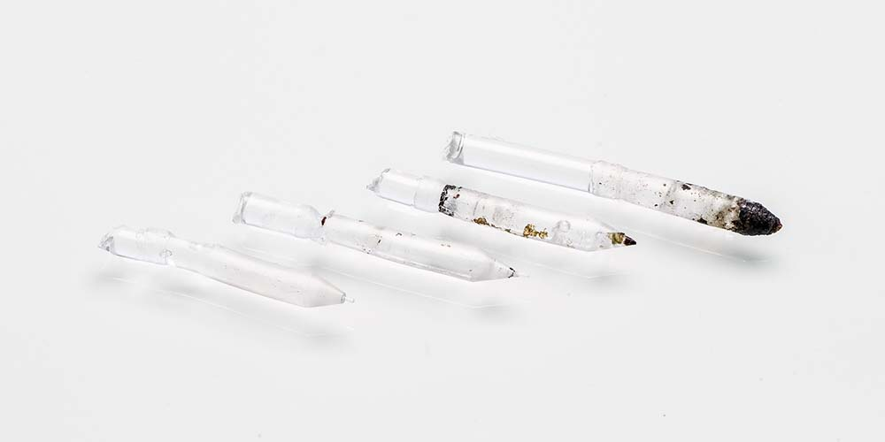

# Clogged Nozzle

> Diagnose, clear, and prevent nozzle clogs.

---

## Overview

A clogged nozzle restricts or completely blocks filament flow, causing under-extrusion, skipped layers, or no extrusion at all. Partial clogs are more common than full clogs and are often mistaken for other issues.

---

## Symptoms

| Symptom | Likely Issue |
|---|---|
| Clicking / grinding from extruder | Partial clog — extruder can't push filament through |
| Under-extrusion that gets worse over time | Partial clog building up |
| Sudden under-extrusion on a new spool | Possible contamination or wrong temp |
| No extrusion at all | Full clog or heat creep jam |
| Filament curling upward at nozzle tip | Partial blockage diverting flow |

---

## Step 1 — Rule Out Other Causes

Before assuming a clog, check:

- **Is the filament loaded correctly?** Pull back and re-feed.
- **Is the temperature correct?** Cold filament won't flow.
- **Is the extruder gripping the filament?** Check idler tension and look for ground filament dust.
- **Has the PTFE tube slipped?** A gap at the heatbreak causes jams that feel like clogs.

---

## Step 2 — Cold Pull (Atomic Pull)

The cold pull is the most effective method for clearing partial clogs and is safe on all hotends.

### What You Need
- PLA or Nylon filament (cleaning filament works best)
- Access to the hotend temperature controls

### Process

1. Heat the nozzle to **printing temperature** for your filament (e.g. 200°C for PLA).
2. Manually push filament through until clean material flows — purge any contamination.
3. **Reduce temperature to 90°C** (PLA) or **110°C** (Nylon) — material will be partially solidified.
4. While at the lower temperature, **pull the filament out firmly with a single smooth motion.**
5. The filament should come out with a tip shaped like the inside of the nozzle, with any debris embedded in it.
6. Inspect the tip — repeat until the pulled filament comes out clean.

*A successful cold pull — the tip is shaped like the nozzle interior and has brown/black debris embedded in it.*

*A clean cold pull — clear or single-colour tip with no debris means the nozzle is clear.*

---

## Step 3 — Needle/Acupuncture Pin

For partial clogs where cold pull has not fully cleared the blockage:

- Heat to printing temperature
- Insert a **0.3–0.35 mm acupuncture needle** into the nozzle tip from below
- Move it gently up and down to break up the clog
- Follow with a cold pull to extract loosened debris

> Do not use a drill bit — it can damage the nozzle bore.

---

## Step 4 — Replace the Nozzle

If cold pulls and needle cleaning don't clear the clog, replace the nozzle:

- Heat hotend to **printing temperature** before attempting removal
- Use a **nozzle spanner or socket** — never cold-remove a nozzle, it will damage threads
- Hold the heater block steady with pliers while turning the nozzle
- See the [Nozzle Guide](../hardware/Nozzle-Guide.md) for replacement details

---

## Prevention

- **Never print below minimum temperature** — cold filament jams.
- **Purge between material changes** — especially when going from high-temp to low-temp materials.
- **Use a silicone sock** — prevents debris from baking onto the heater block.
- **Avoid CF/GF materials in brass nozzles** — abrasive composites wear and clog brass quickly.
- **Dry your filament** — wet filament creates steam, which leaves behind carbonised residue.
- Perform a **cold pull at the end of every session** to leave the nozzle clean.

---

*Back to [Troubleshooting Guides](../README.md#️-troubleshooting-guides) | [README](../README.md)*