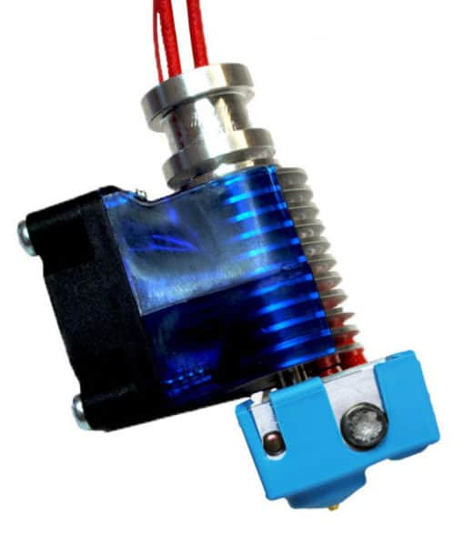
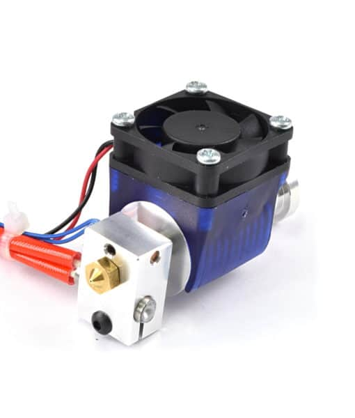

# General Tips — Applies to All Materials

> Quick-reference best practices that apply regardless of what filament you're printing with.

---

## Printer Preparation

- **Dry your filament** before every print — moisture ruins almost every material. Even "dry" filament absorbs humidity within hours in humid climates.
- **Calibrate your e-steps** and flow rate per spool, not just per material type.
- **First-layer calibration** is non-negotiable. A bad first layer causes 90% of failed prints.
- **PID-tune your hotend and bed** when switching material families.

---

## Silicone Socks for Low-Temp Materials

A silicone sock is a small sleeve that wraps around your hotend's heater block. For low-temperature materials like PLA, PETG, and TPU they are one of the most overlooked quality-of-life upgrades you can make.

*A silicone sock fitted on a standard E3D V6 heater block.*

**Benefits:**
- **Temperature stability** — insulates the heater block from the part cooling fan, preventing the fan from fighting your PID and causing temperature swings that show up as surface banding.
- **Prevents filament sticking to the block** — PLA and PETG that ooze onto a bare aluminium block burn, carbonise, and are a pain to clean. A sock keeps the block clean.
- **Reduces heat creep risk** — the sock retains heat more efficiently so your heater doesn't cycle as hard, reducing thermal stress at the heatbreak.
- **Lower power draw** — insulated blocks reach and hold temperature with less energy.
- **Cleaner purges** — ooze drips cleanly off silicone rather than baking onto the block.

*Bare heater block after several PLA prints — filament bakes onto exposed aluminium.*

> 💡 Silicone socks are shape-specific (E3D V6, Volcano, Dragon, Revo, etc.) — make sure you buy the correct one for your hotend. They cost £1–3 and are one of the best-value upgrades for any printer running PLA or PETG.

---

## Slicer Settings Philosophy

- Start with a **known-good community profile** then dial in from there — don't start from scratch.
- Change **one variable at a time** when troubleshooting.
- **Pressure advance / linear advance** makes a huge difference for quality — tune it per filament.
- **Print slower** when in doubt. Speed is the enemy of quality for difficult materials.

---

## Filament Storage

- Store all filament in **airtight containers with desiccant** (silica gel or colour-indicating varieties).
- **Vacuum seal bags** are excellent for long-term storage.
- A **filament dryer** (e.g. Sunlu S2, PrintDry) is one of the best investments you can make.
- Track **date opened** on each spool.

---

*Back to [Troubleshooting Guides](../README.md#️-troubleshooting-guides) | [README](../README.md)*
