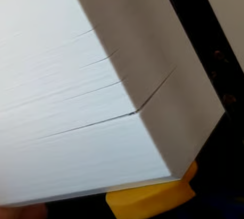
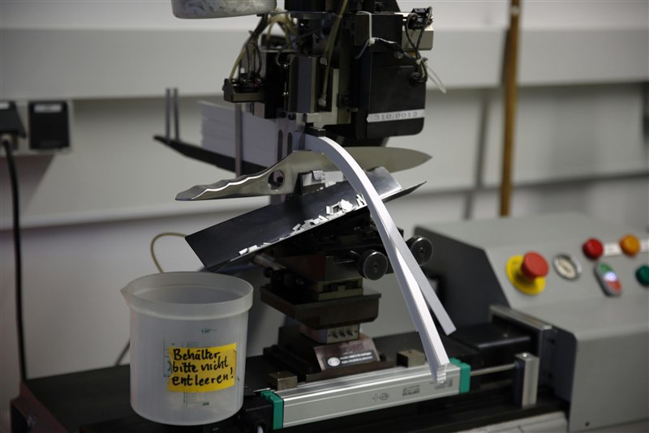

# Layer Adhesion and Delamination

> Fix weak, splitting, or separating layers that reduce part strength.

---

## Overview

Poor layer adhesion produces parts that split along layer lines under stress, have visible gaps between layers, or simply snap far too easily. It is caused by layers not fusing together properly during printing — usually due to temperature, speed, or cooling settings.

*Delaminated layers — the part split along layer lines under minimal force.*

---

## Quick Diagnosis

| Symptom | Likely Cause |
|---|---|
| Layers visibly separate or peel | Temp too low, speed too high, or wet filament |
| Part snaps cleanly along layer line | Under-extrusion, low temp, or too much cooling |
| Gaps or lines visible between layers | Under-extrusion or retraction too high |
| Only fails with engineering materials | Needs enclosure or higher temp |
| Worsens mid-print on tall parts | Heat creep or inconsistent extrusion |

---

## Fix 1 — Increase Nozzle Temperature

Low temperature is the most common cause. Raise temperature in **5°C increments** and test. Use a [Temperature Tower](../tuning/Temperature-Tower.md) to find the ideal balance between adhesion and surface quality.

---

## Fix 2 — Reduce Print Speed

If layers are not fully fusing, the material may not have enough time to bond. Reduce print speed by 20% and check the result. Perimeter speed matters most — inner walls and infill can be faster.

---

## Fix 3 — Reduce Cooling

Excessive part cooling hardens each layer before the next one bonds to it:

| Material | Recommended Cooling |
|---|---|
| PLA | 80–100% |
| PETG | 20–40% |
| ABS / ASA | 0–10% |
| Nylon | 20–40% |
| PC | 0–15% |

Never run high cooling on ABS, ASA, or PC — it causes immediate delamination.

---

## Fix 4 — Dry Your Filament

Wet filament creates steam bubbles during extrusion. These bubbles form weak spots and voids between layers that fail under load.

Signs of wet filament causing layer issues:
- Popping or crackling sounds during printing
- Rough, foamy surface texture
- Visible bubbles or pinholes in the extrusion

See the [Moisture Damage](Moisture-Damage.md) guide for drying instructions.

---

## Fix 5 — Enclosure (Engineering Materials)

For ABS, ASA, Nylon, and PC, cold ambient air causes layers to cool and contract before the next layer fuses to them. An enclosure maintaining the correct chamber temperature is essential:

| Material | Target Chamber Temp |
|---|---|
| ABS / ASA | 45–50°C |
| Nylon | Ambient (draught-free) |
| PC | 50–60°C |

---

## Fix 6 — Check for Under-Extrusion

If not enough material is being deposited, layers will not bond:

- Check flow ratio using the [Flow Rate Calibration](../tuning/Flow-Rate-Calibration.md) guide
- Inspect the nozzle for partial blockage
- Check extruder tension — too loose causes grinding and under-extrusion

---

## Checking Layer Adhesion Strength

To test, print a simple 20x20x40 mm tower and try to snap it along the layer lines by hand. A well-tuned print should not snap cleanly along layers — it should deform or break irregularly.

*A simple tower printed at different settings — snap test reveals actual layer bonding strength.*

---

*Back to [Troubleshooting](../README.md#troubleshooting) | [README](../README.md)*