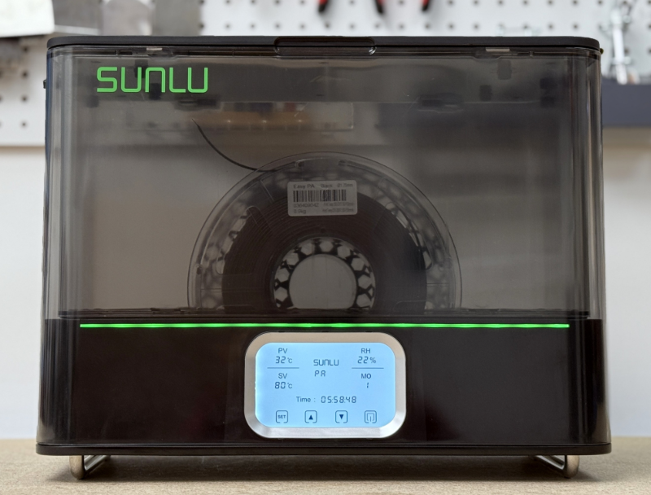
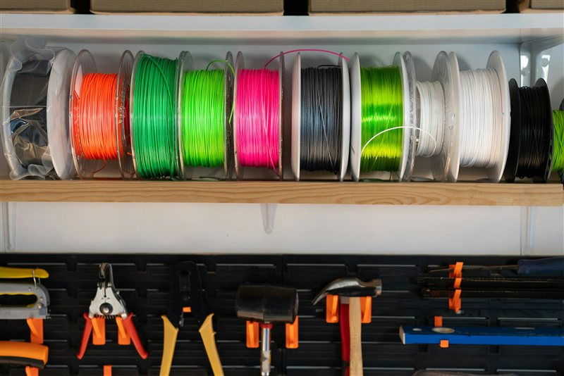

# Moisture Damage

> Identify, dry, and prevent moisture damage in your filament.

---

## Overview

Almost every FDM filament is hygroscopic — it absorbs water from the air. Wet filament causes some of the most frustrating print failures because the symptoms (rough surfaces, bubbling, weak parts, stringing) look like many other problems. Drying the filament often fixes issues that hours of slicer tuning cannot.

---

## Symptoms of Wet Filament

| Symptom | Notes |
|---|---|
| Popping, crackling, or hissing sounds | Steam escaping from the melt zone — most obvious sign |
| Rough, bubbly, or foamy surface texture | Steam bubbles bursting at the nozzle |
| Excessive stringing | Wet filament has lower viscosity and oozes more |
| Reduced part strength | Steam voids weaken layer bonds |
| Inconsistent extrusion / under-extrusion | Steam disrupts flow |
| Brown or discoloured extrusion | Degraded material from moisture reactions |

---

## Moisture Sensitivity by Material

| Material | Sensitivity | Notes |
|---|---|---|
| PLA | Low–Medium | Absorbs slowly, a few hours in humid air causes subtle issues |
| PETG | Medium | 12–24 hrs exposure causes stringing and rough surfaces |
| ABS / ASA | Low | Less sensitive than most, but still benefits from drying |
| TPU | Medium | Wet TPU bubbles and loses elasticity |
| Nylon | **Extreme** | Absorbs moisture within 30–60 minutes — must print from dryer box |
| PC | High | Dry before every session |
| PVA | **Extreme** | Degrades within hours — store sealed at all times |
| PEEK | High | Dry at high temp before every print |

---

## Drying Guide

| Material | Temperature | Duration | Notes |
|---|---|---|---|
| PLA | 45–50°C | 4–6 hrs | Do not exceed 55°C — PLA softens |
| PETG | 65–70°C | 4–6 hrs | |
| ABS / ASA | 60–80°C | 4–6 hrs | |
| TPU | 50–60°C | 4–6 hrs | Check shore hardness — softer TPU may deform |
| Nylon | 70–80°C | 8–12 hrs | Bone dry required — print directly from dryer box |
| PC | 80°C | 6–8 hrs | |
| PVA | 45–50°C | 6–8 hrs | Do not exceed 55°C |
| HIPS | 60°C | 4–6 hrs | |
| PEI / Ultem | 120°C | 4–6 hrs | Requires high-temp capable dryer |
| PEEK | 120–150°C | 6+ hrs | Requires industrial oven or high-temp dryer |

> ⚠️ **Do not dry filament in a food oven used for cooking.** Filament off-gases chemicals at drying temperatures.

---

## Drying Methods

### Dedicated Filament Dryer (Recommended)
Filament dryers (Sunlu S2, PrintDry Pro, Polymaker PolyDryer) hold the spool at temperature and circulate air:
- Most convenient option
- Can print directly from the dryer
- Consistent, safe temperatures
- Worth it if you print more than once a week

*A dedicated filament dryer — the best way to dry and print simultaneously.*

### Food Dehydrator
A cheap and effective option for PLA, PETG, ABS, TPU:
- Usually reaches 35–70°C
- Not suitable for Nylon, PC, or high-temp materials that need 70°C+
- Use a thermometer to verify actual temperature — dials are often inaccurate

### Oven
A last resort — use only a dedicated oven, not your kitchen oven:
- Set to the lowest available temperature
- Verify with an oven thermometer — ovens are notoriously inaccurate at low temps
- Leave the door slightly ajar to allow moisture to escape

---

## Storage

- **Airtight containers with desiccant** (silica gel) for all filament not in active use
- **Vacuum seal bags** extend storage life significantly for hygroscopic materials
- Use **colour-indicating silica gel** so you can see when it needs recharging
- **Recharge silica gel** in an oven at 120°C for 1–2 hours when it changes colour
- Label spools with **date opened** — even stored filament degrades over months

*Airtight storage with fresh desiccant — essential for Nylon, PC, and PVA.*

---

*Back to [Troubleshooting Guides](../README.md#️-troubleshooting-guides) | [README](../README.md)*