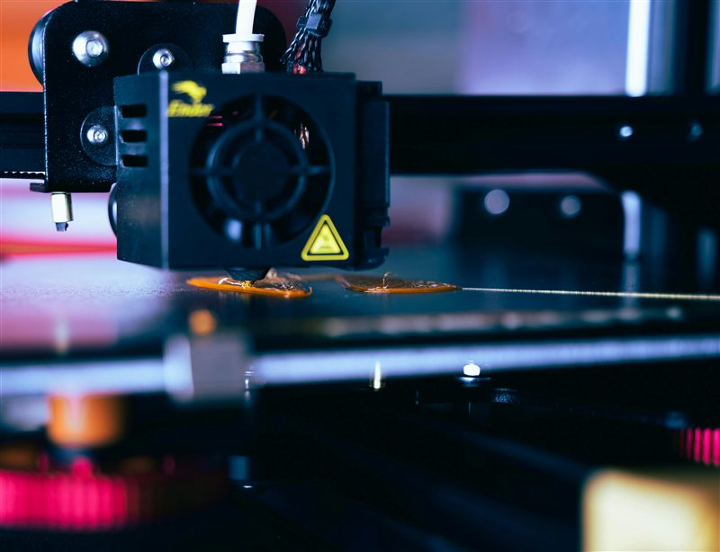

# Stringing

> Eliminate the fine plastic hairs left between features during travel moves.

---

## Overview

Stringing occurs when molten filament oozes from the nozzle during travel moves, leaving thin threads across open gaps. It is one of the most common print quality issues and is caused by a combination of temperature, retraction, and travel settings.

*Heavy stringing — threads left between towers during travel moves.*

---

## Root Causes (Fix in This Order)

1. **Temperature too high** — the most common cause. Hot filament oozes more freely.
2. **Retraction too low** — not pulling filament back far enough before travel.
3. **Travel speed too slow** — nozzle spends too long crossing open air.
4. **Wet filament** — moisture makes filament runny and increases ooze.
5. **Pressure advance not set** — excess pressure bleeds out during travel.

---

## Fix 1 — Reduce Temperature

Drop nozzle temperature in **5°C increments** and test. This is usually the fastest fix.

Run a [Temperature Tower](../tuning/Temperature-Tower.md) to find the minimum temperature that still gives good layer adhesion.

---

## Fix 2 — Tune Retraction

Follow the [Retraction Calibration](../tuning/Retraction-Calibration.md) guide. Key starting points:

| Setup | Retraction Distance |
|---|---|
| Direct drive | 0.5–2.0 mm |
| Bowden | 3.0–7.0 mm |
| TPU / flexible | 0–0.5 mm (or disabled) |

---

## Fix 3 — Increase Travel Speed

In Orca Slicer under **Print Settings > Speed**, increase travel speed to 150–200 mm/s. The faster the nozzle crosses open air, the less time it has to ooze.

---

## Fix 4 — Enable Avoid Crossing Perimeters

In Orca Slicer under **Print Settings > Travel**, enable **Avoid crossing walls**. This routes travel moves around the outside of the print rather than across open gaps — eliminating most stringing opportunities entirely.

*Avoid crossing walls routes travel around the print perimeter — fewer strings, cleaner result.*

---

## Fix 5 — Dry Your Filament

Wet filament oozes excessively. Dry according to your material:

| Material | Dry Temp | Duration |
|---|---|---|
| PLA | 45–50°C | 4–6 hrs |
| PETG | 65–70°C | 4–6 hrs |
| ABS / ASA | 60–80°C | 4–6 hrs |
| Nylon | 70–80°C | 8–12 hrs |
| TPU | 50–60°C | 4–6 hrs |

See the [Moisture Damage](Moisture-Damage.md) guide for full drying guidance.

---

## Material-Specific Notes

| Material | Stringing Tendency | Key Fix |
|---|---|---|
| PLA | Low–Medium | Temp is usually the culprit |
| PETG | High | Lower temp + avoid crossing walls + lower retraction |
| ABS / ASA | Medium | Enclosure prevents cool drafts that worsen stringing |
| TPU | High | Disable retraction, increase travel speed |
| Nylon | Medium | Dry thoroughly first |

---

## Post-Print — Cleaning Strings

- A **heat gun on low** (or lighter held briefly) will melt and retract most strings without damaging the print.
- A **stiff brush** removes fine hairs on detailed models.
- Warm water (for PLA) can soften and wipe strings on smooth surfaces.

---

*Back to [Troubleshooting](../README.md#troubleshooting) | [README](../README.md)*