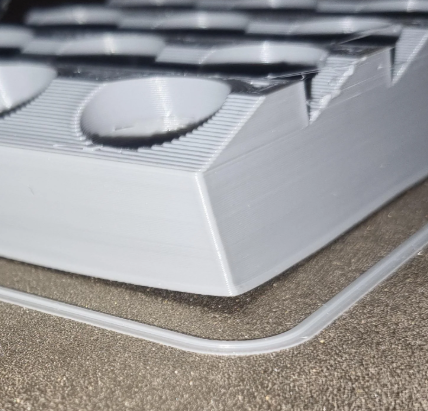
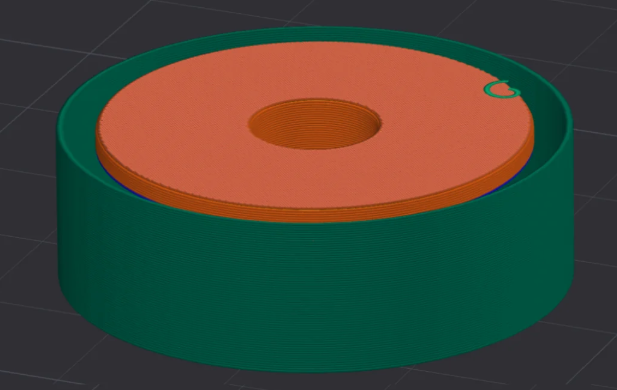

# Warping and Adhesion Failures

> Stop prints lifting, curling, and detaching from the bed mid-print.

---

## Overview

Warping happens when the outer edges or corners of a print cool faster than the centre, causing thermal stress that pulls the part off the bed. It is the primary challenge with engineering materials and affects some materials (ABS, ASA, Nylon, PC) far more than others (PLA, PETG).

*Classic warping on an ABS print — corners lift and the part curves upward.*

---

## Quick Diagnosis

| Symptom | Most Likely Cause |
|---|---|
| Corners lifting during print | Thermal stress — enclosure or bed temp needed |
| First layer not sticking at all | Bed too cold, dirty, wrong Z offset, wrong surface |
| Print sticks then pops off layer 3–5 | Bed cools too fast, no enclosure, draft |
| Elephant foot (flared base) | First layer squished too much, bed too hot |
| Large flat parts delaminating from bed | Shrinkage — brim + enclosure + slower cooling |

---

## Fix 1 — Correct Bed Temperature

Most adhesion problems come down to bed temperature. Use these targets:

| Material | Bed Temp |
|---|---|
| PLA | 55–65°C |
| PETG | 75–85°C |
| ABS / ASA | 100–110°C |
| Nylon | 70–85°C |
| PC | 110–120°C |

---

## Fix 2 — Clean the Bed

A contaminated bed is one of the most common causes of poor first-layer adhesion:

- Wipe PEI surfaces with **99% IPA** before every print
- Never touch the print surface with bare hands — skin oil destroys adhesion
- For stubborn residue: wash with warm water and dish soap, dry thoroughly
- Re-season textured PEI occasionally with IPA and a re-heat cycle

---

## Fix 3 — Add a Brim

A brim adds extra perimeter lines around the base of the print, dramatically increasing the contact area with the bed:

- **5–8 mm brim** for PLA and PETG
- **10–15 mm brim** for ABS, ASA, and Nylon
- **15 mm+ brim** for PC and high-temp materials

Enable in Orca Slicer under **Print Settings > Support > Brim**.

---

## Fix 4 — Enclosure

For ABS, ASA, Nylon, and PC, an enclosure is essential. Ambient airflow cools the print unevenly, causing warping:

- Even a simple cardboard box over the printer dramatically helps for ABS
- Target chamber temperatures: ABS/ASA 45–50°C, PC 50–60°C
- Turn off part cooling fan entirely for ABS/ASA

See the [Enclosure Guide](../hardware/Enclosure-Guide.md) for build options.

---

## Fix 5 — Use the Right Bed Surface and Adhesive

| Material | Best Surface | Adhesive |
|---|---|---|
| PLA | Textured PEI | None (IPA clean only) |
| PETG | Textured PEI | Thin glue stick as release agent |
| ABS / ASA | Textured PEI | ABS/ASA slurry or Magigoo ABS |
| Nylon | Garolite/G10 | PA Glue or Vision Miner |
| PC | PEI | Magigoo PC or Vision Miner |
| PEEK / PEI | Aluminium | Vision Miner Nano Polymer |

---

## Fix 6 — Slow Down First Layers

First layer speed directly affects adhesion. In Orca Slicer:
- Set first layer speed to **25–30 mm/s** regardless of print speed
- Set first layer height to **0.2–0.25 mm** for better squish
- Allow adequate bed soak time (5+ minutes at temp before printing)

---

## Fix 7 — Draft Shield

For tall ABS/ASA/Nylon prints, a draft shield adds a sacrificial wall around the print that stabilises the ambient temperature:

Enable in Orca Slicer under **Print Settings > Other > Draft Shield**.

*Draft shield keeps a stable warm air pocket around the print, reducing warping on tall parts.*

---

*Back to [Troubleshooting Guides](../README.md#️-troubleshooting-guides) | [README](../README.md)*