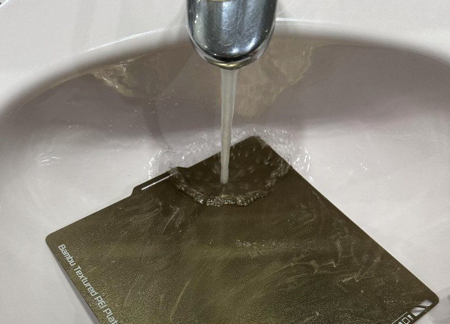
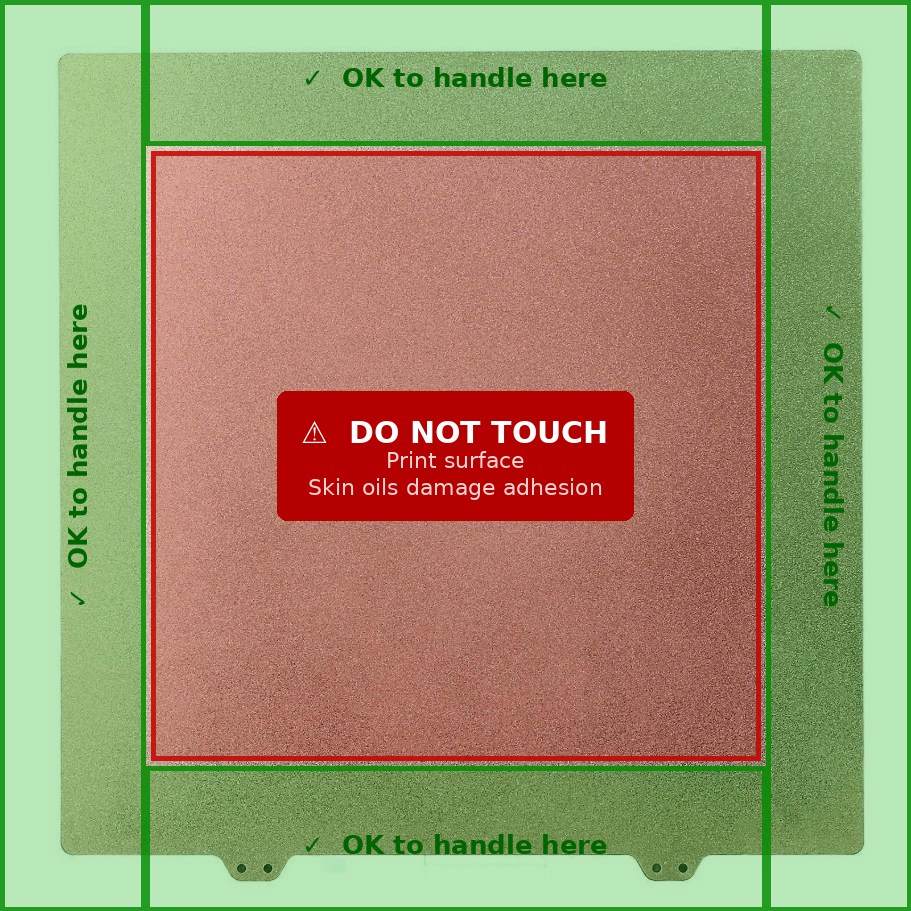
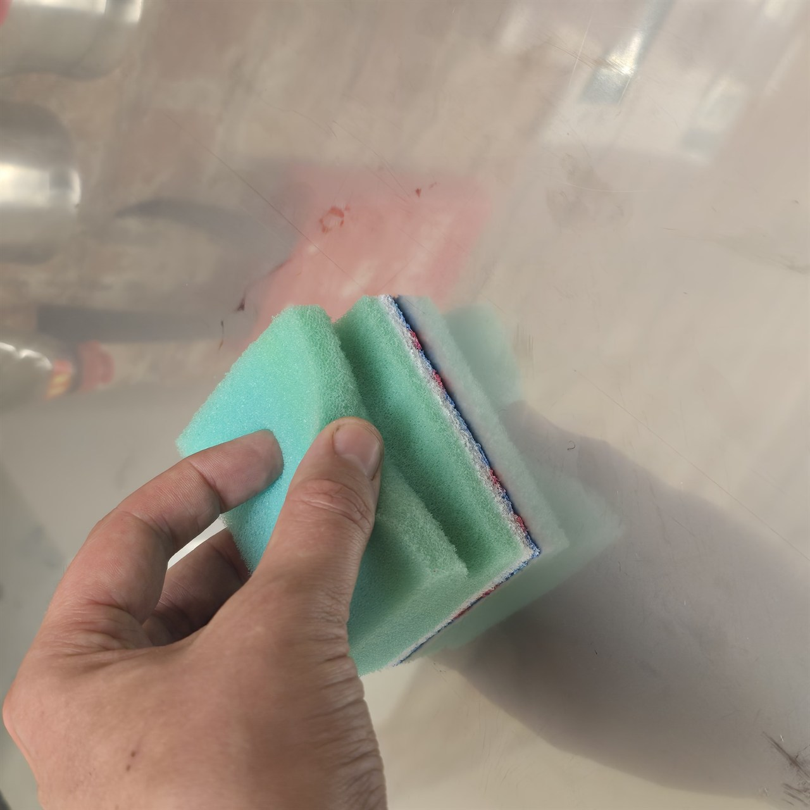

# Build Surface Preparation & Handling

> **Difficulty:** ⭐ Beginner | **Applies to:** All printers and surface types | **Impact:** First layer adhesion, print success rate, surface lifespan

---

## The Most Overlooked Step

No amount of Z-offset tuning, bed levelling, or adhesion spray will compensate for a contaminated build surface. Finger oils, silicone from bed releases, dust, and residue from previous prints all accumulate invisibly and cause inconsistent first-layer adhesion that looks like a different problem entirely.

This guide covers how to properly clean and maintain every common surface type so your first layer sticks when it should and releases cleanly when the print is done.

---

## The Golden Rule — Soap and Water First

**Every surface — including brand new ones — should be washed with dish soap and warm water before first use.**

Manufacturers apply release agents and protective coatings during production that IPA does not remove. Skipping this step on a new plate is the reason many people spend hours chasing first-layer problems on what should be a perfectly good surface.

### How to Wash



1. Remove the plate from the printer
2. Run under warm water and apply a small amount of dish soap
3. Scrub firmly with your hand or a clean cloth in circular motions — really work it over the whole surface
4. Rinse thoroughly until the water sheets off cleanly rather than beading
5. Dry with **paper towels** or air dry — do not use cloth towels. Fabric softener and laundry residue in cloth leave a thin oil film straight back onto the surface you just cleaned

Repeat this wash whenever adhesion becomes inconsistent. IPA maintenance is fine between prints, but full soap-and-water washes are needed regularly — especially after printing materials that leave residue (PETG, TPU).

---

## Surface Handling



**Never touch the print surface with bare hands.** Finger oils transfer instantly and are effectively invisible until your first layer starts refusing to stick in random patches.

- Pick up plates by the edges or tabs
- If you need to handle the surface area, use paper towels as a barrier
- Don't let gloves that have touched other surfaces touch the plate either — vinyl and nitrile gloves pick up oils from everything

This matters most for smooth PEI and glass, which are the most sensitive to contamination.

---

## IPA — What It's Actually Good For

Isopropyl alcohol (90%+) is excellent for removing the light oil and residue that accumulates between prints from filament, handling, and airborne contamination. Use it as a maintenance clean between every print or every few prints.

What IPA is **not** good for: removing silicone-based release agents, build-up from repeated PETG or TPU prints, or the protective coating on brand new plates. These need soap and water.

```
Routine maintenance: IPA wipe between prints
Full reset: Soap and water wash when adhesion becomes inconsistent
```

---

## Surface-Specific Notes

### Textured PEI (Spring Steel)

The most forgiving surface for day-to-day use. Textured PEI grips strongly when hot and releases cleanly when cold — most materials need nothing but a clean surface to adhere well.

- Wash with soap and water on first use and whenever adhesion drops
- IPA wipe between prints
- Avoid anything abrasive — the texture is functional, not decorative, and worn patches will stop gripping
- If parts won't release when cool, wait longer — some materials grip harder than others until the plate drops below 35°C

### Smooth PEI

Smooth PEI gives a glass-like underside finish on prints. It's more sensitive to contamination than textured and more prone to adhesion failure on larger prints.

**Scuffing smooth PEI** dramatically improves adhesion for most materials and is worth doing if you're fighting with adhesion issues on flat parts:



*Left: unscuffed smooth PEI — glass-like surface that repels some materials. Right: lightly scuffed with a kitchen scouring pad — improved mechanical grip with minimal visual change.*

1. Use a clean kitchen scouring pad (the scratchy side) or 800–1000 grit wet/dry sandpaper
2. Scrub in circular motions across the full surface
3. Wash thoroughly with soap and water to remove the abraded particles
4. The surface will look very slightly less shiny — this is normal and the increased grip is worth it

Trade-off: you lose the glass-smooth underside finish. If that finish matters for your prints, keep one scuffed plate for adhesion-critical materials and one unscuffed for cosmetic surfaces.

### Glass

Clean glass with soap and water. For PLA, a very thin layer of glue stick (Pritt stick or equivalent) improves adhesion and release significantly. Wipe with a damp cloth between prints to refresh the glue layer.

Glass is sensitive to thermal shock — avoid pouring cold water on a hot glass plate or removing it quickly from a hot printer to a cold environment.

### Garolite (G10/FR4)

Used primarily for Nylon and PPS. Nylon adheres directly to garolite without adhesives and releases cleanly when cool.

Clean with IPA — garolite is not as sensitive to oil contamination as PEI. Soap and water is fine periodically but IPA is sufficient for routine maintenance.

### BuildTak / PEX

Clean with IPA. Avoid acetone and strong solvents — they soften the surface coating and shorten its life.

---

## Adhesion Aids — When to Use Them

A properly clean surface should not need adhesion aids for most materials on most surfaces. If you're reaching for glue stick or hairspray routinely, treat that as a sign that the surface needs cleaning or replacing, not as a long-term solution.

**Genuine use cases for adhesion aids:**

| Situation | Recommended Aid |
|---|---|
| Nylon on glass | Glue stick (Pritt or equivalent) |
| PLA on glass | Glue stick |
| PEEK / PEKK / PEI on any surface | Vision Miner Nano Polymer Adhesive |
| PPS on PEI or aluminium | Vision Miner Nano Polymer Adhesive |
| ABS/ASA that won't release cleanly | Thin layer of glue stick acts as a release agent |

> ⚠️ **Glue stick as a release agent for ABS:** A very thin layer between ABS and PEI makes removal dramatically easier by breaking the direct polymer-to-polymer bond. This is different from using it for adhesion — the ABS sticks to the glue layer, which releases cleanly from the PEI when cool.

---

## When to Replace a Surface

| Sign | Action |
|---|---|
| Adhesion inconsistent across the plate despite cleaning | Worn or damaged surface — replace |
| PEI coating peeling or flaking | Replace immediately — flakes will embed in prints |
| Deep scratches or gouges | Replace — they cause print defects and weak spots |
| Surface won't clean up even with soap and water | Replace |

Spring steel plates are consumables. Budget for replacement every 6–18 months depending on use, materials printed, and care taken.

---

*Back to [Tuning Guides](../README.md#-tuning-guides) | [README](../README.md)*
