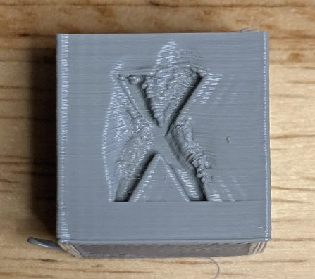

# Cooling & Layer Times

> **Difficulty:** ⭐⭐ Beginner | **Applies to:** All slicers | **Affects:** Overhangs, bridges, surface quality, warping risk

---

## Why Cooling Gets Ignored

Most people set part cooling once during initial setup and never revisit it. The result is either over-cooled engineering prints that delaminate, or under-cooled standard prints with saggy overhangs and blobby details. Getting cooling dialled properly for each material is one of the highest-return tuning steps there is — and it costs nothing.

---

## What Happens When Cooling Is Wrong

### Too Little Cooling

*Classic signs of insufficient cooling: drooping overhangs, rough top surfaces, elephant foot on the first layers of objects that heat-soak over long prints, and melted bridges.*

- Overhangs droop or curl upward
- Bridges sag and string across gaps
- Fine details (pointed tops, small text) melt and blob
- Top surfaces look rough and cratered
- On longer prints: lower layers soften and deform as the part heats up

### Too Much Cooling

- Layer adhesion suffers — the previous layer cools below bonding temperature before the new one lands
- Warping and cracking in enclosure-dependent materials (ABS, ASA, PA, PC)
- Z-banding from uneven thermal contraction between layers
- Reduced part strength overall

---

## Cooling by Material

This is where most guides get it wrong — they imply "more cooling is always better." It isn't. The correct amount depends entirely on the material:

| Material | Part Cooling | Notes |
|---|---|---|
| PLA | 80–100% | PLA needs cooling — run it high. Slight strength reduction is the only trade-off |
| PETG | 30–60% | Too much fan causes poor layer bonding and stringing. Back off from PLA instincts |
| ABS | 0–15% | Even in an enclosure. More than this causes layer splits and cracking |
| ASA | 0–15% | Same as ABS — minimal fan, enclosure required |
| TPU | 20–50% | Moderate cooling. Too much stiffens the part during printing and causes adhesion issues |
| Nylon | 0–20% | Minimal — nylon needs time to bond. PA12 tolerates more than PA6 |
| PC | 0% | No fan. Ever. |
| PEEK / PEI / PEKK | 0% | Absolutely no part cooling. See the high-temp material guides |

> 💡 **Varying fan speed during a print causes inconsistent layers.** Banding appears where speed changes happened. Set a target and hold it. The exception is the first few layers — ramp fan speed in after layer 3–5 to protect bed adhesion, then hold constant.

---

## Adjusting for Chamber Temperature

If you print ABS or ASA in an actively heated enclosure, the required fan speed isn't fixed — it scales with chamber temperature. A hotter chamber means the parts are cooling more slowly passively, so you need proportionally more fan to achieve the same effective cooling.

**Example — ABS in an enclosed printer with 5015 fans:**

| Chamber Temp | Fan Speed (large prints) | Fan Speed (small prints / overhangs) |
|---|---|---|
| 40°C | 10–20% | 30–40% |
| 50°C | 20–30% | 40–60% |
| 63°C | 40–50% | 80–100% |

Test with a small overhanging test piece at different chamber temperatures and note where the overhangs stop drooping. That's your minimum effective fan speed for that material at that chamber temperature.

---

## Minimum Layer Time

Minimum layer time (also called "layer time goal" or "slow down if layer print time is below") forces the printer to slow down on short layers so the previous layer has time to cool before the next one lands on it.

*Without minimum layer time, a tall narrow object like a pointed tower or a thin tower gets progressively worse as the printhead returns to each layer before the previous one has cooled. The result is a melted, drooping tip.*

**Recommended minimums:**

| Material | Minimum Layer Time |
|---|---|
| PLA | 8–12 seconds |
| PETG | 10–15 seconds |
| ABS / ASA | 15–20 seconds |
| TPU | 10–15 seconds |
| Nylon | 15–20 seconds |

Where to find it in your slicer:
- **Orca Slicer:** Filament Settings → Cooling → Slow printing down for better layer cooling
- **PrusaSlicer / SuperSlicer:** Filament Settings → Cooling → Slow down if layer print time is below
- **Cura:** Cooling → Minimum Layer Time

> ⚠️ Minimum layer time slows the printhead down, which can actually worsen overheating if you're already at low fan speeds — the nozzle lingers on the part longer. If you're seeing degradation, try both increasing the layer time **and** the fan speed together rather than one alone.

---

## Using Multiple Objects as a Cooling Strategy

If you're printing a single tall narrow object that's overheating, one effective approach is printing two or more copies simultaneously. The toolhead travels between them on each layer, giving each object time to cool while the other is being printed.

Keep the objects far enough apart that the travel between them is meaningful — typically 40–80mm. Too close and the benefit is minimal; too far and stringing becomes an issue.

---

## Overhang Fan Speed Ramping

Some slicers let you set a separate fan speed specifically for overhang regions — automatically increasing cooling on steep overhangs without affecting the main body of the print.

In **Orca Slicer**: Filament Settings → Cooling → **Overhang fan speed** — set this higher than your normal fan speed and it applies only to regions the slicer identifies as overhanging.

This is particularly useful for PETG and Nylon where you want low baseline cooling but need more airflow on the overhangs that would otherwise droop.

---

## Common Problems

| Problem | Likely Cause | Fix |
|---|---|---|
| Drooping overhangs | Not enough cooling | Increase fan speed for the material |
| Warping / layer cracks on ABS/ASA | Too much cooling | Reduce fan to 0–10%, check enclosure temperature |
| Layer adhesion weak throughout | Fan too high for engineering material | Reduce fan speed significantly |
| Melted tip on narrow towers | No minimum layer time set | Add 10–15 second minimum layer time |
| Banding / inconsistent layers | Fan speed changing mid-print | Use a constant fan speed — don't ramp up/down during a print |
| PETG stringing getting worse with more fan | Typical PETG behaviour — fan cools strings before they can break | Reduce fan to 30–40%, increase retraction slightly |

---

*Back to [Tuning Guides](../README.md#-tuning-guides) | [README](../README.md)*
