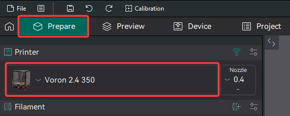
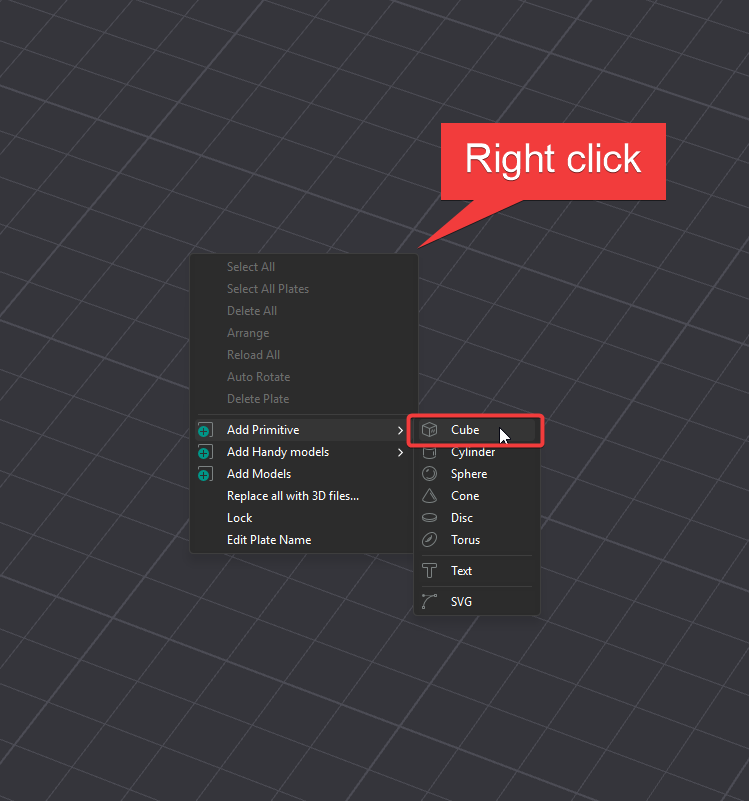
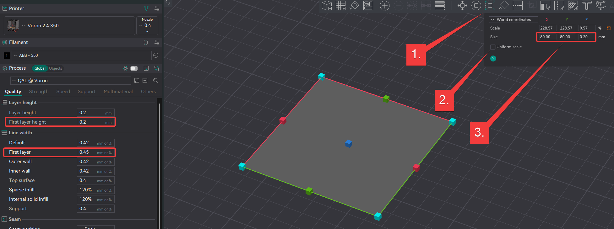
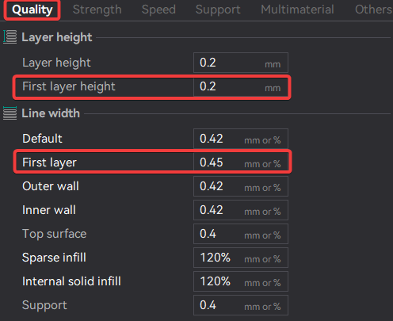
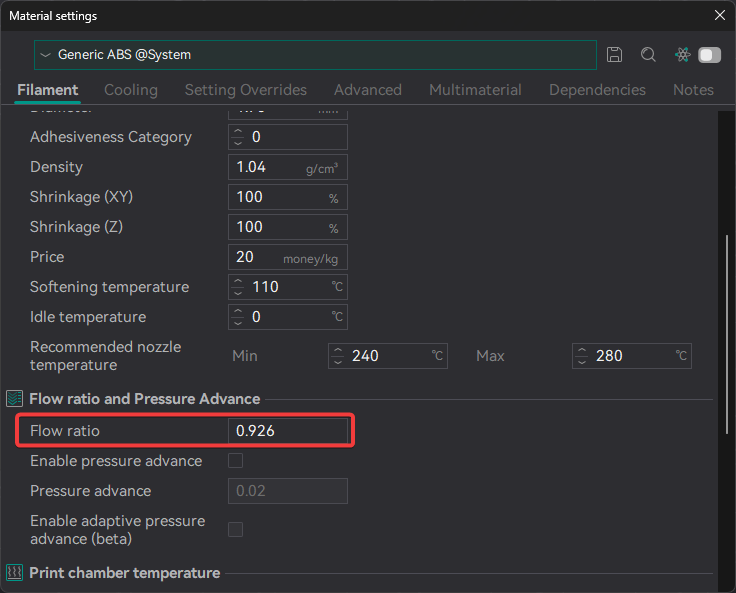
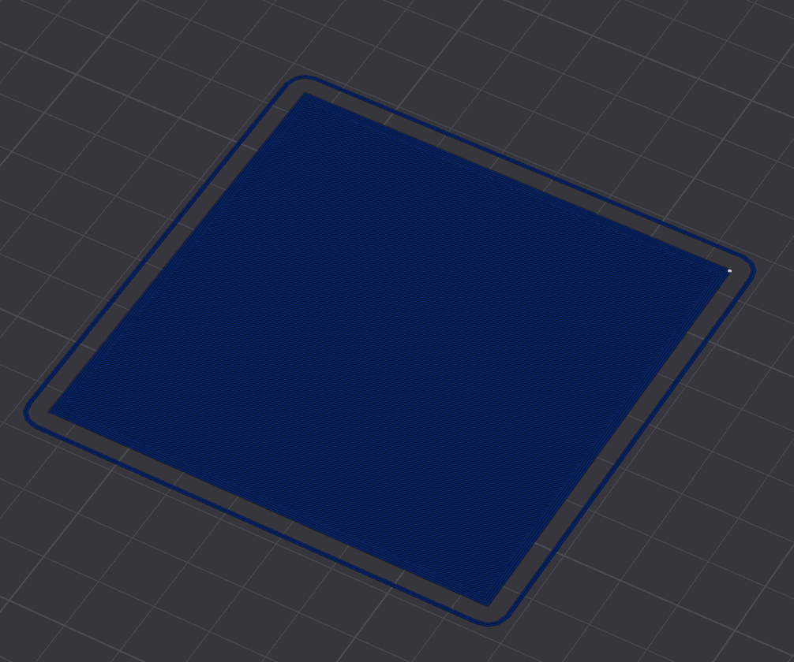
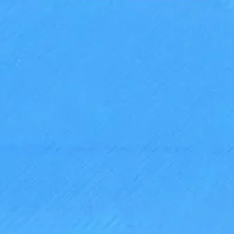
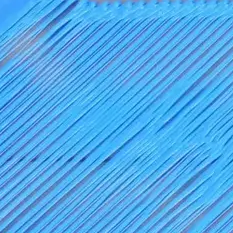
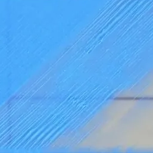
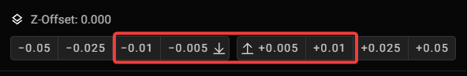

# First Layer Calibration — Orca Slicer

> Getting your first layer right is the single most important calibration step on any FDM printer. A well-tuned first layer means reliable adhesion, consistent surface quality, and fewer failed prints.

---

## What You Need

- **Orca Slicer** (free — download from [github.com/SoftFever/OrcaSlicer](https://github.com/SoftFever/OrcaSlicer))
- Your printer added and configured in Orca Slicer
- Correct filament profile loaded
- A clean, level bed

---

## Step 1 — Open Orca Slicer and Create a New Project

Launch Orca Slicer. If you have not already added your printer, go to **File > Printer** and add it now.

*Orca Slicer main workspace. Your printer should appear in the top-left dropdown.*

---

## Step 2 — Add an 80x80mm Square

We will use a simple flat square as the calibration print. It gives you a large, even surface to assess squish, flow, and adhesion across the whole bed.

1. Click **Add > Primitives > Cube** in the toolbar (or press the Add Object button)
2. With the cube selected, open the **Object Settings** panel on the right
3. Set the dimensions to:
   - **X: 80 mm**
   - **Y: 80 mm**
   - **Z: 0.2 mm** (exactly one layer tall)
4. Centre the object on the bed using the **Centre** button

*Adding a cube primitive — resize it to 80 x 80 x 0.2 mm in the object dimensions panel.*

*The object should be a thin flat square sitting flush on the bed.*

---

## Step 3 — Set Print Settings

In the **Print Settings** panel on the right:

1. Set **Layer Height** to **0.2 mm**
2. Set **First Layer Height** to **0.2 mm** (match them for this test)
3. Set **Infill** to **100%** — you want solid coverage to assess flow evenly
4. Set **Walls** to **1** — this is a flow/adhesion test, not a strength test
5. Turn **off** supports and brim

*Key settings: 0.2mm layer height, 100% infill, 1 wall, no supports.*

---

## Step 4 — Set Your Flow Ratio

In the **Filament Settings** tab, find the **Flow Ratio** field. Use the recommended starting value for your material from the table below, then tune from there.

*Flow Ratio is found in the filament profile under Filament Settings > Flow.*

### Recommended Flow Ratio by Material

| Material | Starting Flow Ratio | Notes |
|---|---|---|
| PLA | 0.98 | Most PLA benefits from slightly under-extruding |
| PETG | 0.95 | PETG over-extrudes easily — start conservative |
| ABS | 1.00 | Standard starting point |
| ASA | 1.00 | Same ballpark as ABS |
| TPU | 0.98 | Varies by shore hardness — calibrate per spool |
| Nylon (PA) | 1.00 | Dry thoroughly before calibrating |
| PC | 1.00 | Calibrate once filament is fully dry |
| PEI / Ultem | 1.00 | High-temp — verify with test print |
| PEEK | 1.00 | Print slow; adjust only after stable temps confirmed |
| CF Composites | 1.02–1.05 | CF restricts flow — start at 1.02, raise if needed |
| PVA | 0.95 | Over-extrudes easily — keeps interfaces clean |
| HIPS | 1.00 | Standard starting point |

> These are starting values. Every printer and spool is different — use this test to dial in the final number.

---

## Step 5 — Slice and Check the Preview

Click **Slice**. In the preview, switch to **Line Type** colouring and scrub to Layer 1.

The layer should show:
- Complete, even coverage with no gaps
- Clean edges with no bulging
- Solid infill lines touching each other without overlapping excessively

*Layer preview in Line Type mode. Infill lines should be evenly spaced with no obvious gaps.*

---

## Step 6 — Print and Assess

Send the print to your printer. Watch the first layer closely.

### What to Look For

| What You See | What It Means | Fix |
|---|---|---|
| Lines squished flat, shiny, slightly translucent | Perfect — good Z offset and flow | None needed |
| Gaps between lines | Z too high or flow too low | Lower Z offset or raise flow ratio |
| Lines piling up, nozzle dragging | Z too low or flow too high | Raise Z offset or lower flow ratio |
| Lines not sticking to bed | Z too high or bed temp too low | Lower Z, raise bed temp |
| Uneven squish across bed | Bed not level / mesh needs update | Re-level or update bed mesh |

*A well-tuned first layer: even, slightly squished, no gaps, good adhesion.*

*Z offset too high: lines are round and not bonding to the bed.*

*Z offset too low: lines are over-squished and the nozzle may drag through material.*

---

## Step 7 — Adjust Live Z Offset

Most printers let you adjust the Z offset live during the print using the LCD or Orca Slicer's controls.

- **Lower Z (more negative)** = nozzle closer to bed = more squish
- **Higher Z (less negative)** = nozzle further from bed = less squish

Adjust in **0.05 mm increments** and watch how the lines change. When the layer looks right, save the new offset.

*Live Z offset adjustment — most printers expose this during the print.*

---

## Step 8 — Fine-Tune Flow Ratio

Once your Z offset is correct, reprint the square with your current settings.

If lines still have visible gaps — increase flow ratio by **0.02** and retest.
If lines are over-extruding and bulging — decrease flow ratio by **0.02** and retest.

Repeat until the layer is perfectly even. Save the final flow ratio to your filament profile in Orca Slicer so it applies to all future prints with that filament.

---

## Summary Checklist

- [ ] Printer and filament profile loaded in Orca Slicer
- [ ] 80 x 80 x 0.2 mm cube created and centred
- [ ] Layer height 0.2 mm, 100% infill, 1 wall
- [ ] Flow ratio set to material starting value (see table above)
- [ ] Sliced and layer preview checked
- [ ] Printed and first layer assessed visually
- [ ] Z offset dialled in — lines squished evenly with no gaps
- [ ] Flow ratio fine-tuned and saved to filament profile

---

*Back to [Tuning Guides](../README.md#tuning-guides) | Back to [README](../README.md)*