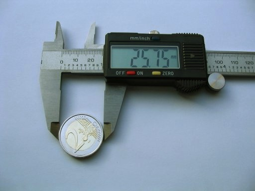

# Flow Rate Calibration

> Accurately set your extrusion multiplier so the printer deposits exactly the right amount of filament.

---

## Overview

Flow rate (also called extrusion multiplier or flow ratio) controls how much filament the printer extrudes relative to what the slicer expects. An incorrect flow rate causes over-extrusion (blobs, rough surfaces, gaps in top layers) or under-extrusion (gaps between lines, weak parts, rough top surfaces). The material files in this guide give starting values — use this process to dial in the exact value for each spool.

---

## Method — Single Wall Cube (Most Accurate)

This method prints a single-wall box and measures the wall thickness with digital calipers. The ratio of measured vs expected thickness gives your corrected flow rate.

### What You Need
- Orca Slicer
- Digital calipers (0.01 mm resolution recommended)
- Current flow ratio set to 1.00 as a baseline

---

## Step 1 — Open the Calibration Tool

In Orca Slicer go to **Calibration > Flow Rate**. Orca will generate the test object automatically.

*Calibration > Flow Rate in Orca Slicer.*

---

## Step 2 — Configure the Print

- Set walls to **1 perimeter**
- Set infill to **0%**
- Disable top and bottom layers
- Layer height: **0.2 mm**
- Reset flow ratio to **1.00** before running this test

*Single wall, no infill, no top/bottom layers — isolates the extrusion amount.*

---

## Step 3 — Print and Measure

Print the test cube. Once cooled, measure the wall thickness at **several points** around the cube (mid-height, not at the corners) using calipers. Take 4-6 measurements and average them.

*Measure mid-wall, mid-height — avoid corners where PA and speed effects are strongest.*

---

## Step 4 — Calculate Your Flow Ratio

Use this formula:

`\nNew Flow Ratio = Current Flow Ratio x (Expected Wall Thickness / Measured Wall Thickness)\n`\n
Where **Expected Wall Thickness** = your nozzle diameter (e.g. 0.40 mm for a 0.4 mm nozzle).

**Example:**
- Nozzle: 0.4 mm
- Measured wall: 0.43 mm
- Current flow ratio: 1.00
- New flow ratio: 1.00 x (0.40 / 0.43) = **0.93**

---

## Step 5 — Apply and Verify

Enter the new flow ratio in your filament profile under **Filament Settings > Flow**. Reprint the cube and measure again — the wall should now measure within 0.01–0.02 mm of your nozzle diameter.

*Left: over-extruding wall (too thick). Right: correctly calibrated wall.*

---

## Tips

- **Calibrate per spool** — even the same brand and colour can vary between batches.
- **Dry your filament first** — moisture causes inconsistent extrusion and will throw off your measurement.
- This is the method that produces the flow ratio values listed in each material file in this guide.
- If your measured wall is very close to target (within 0.02 mm), the difference is not worth adjusting.
- **PETG and flexible materials** tend to need lower flow ratios (0.92–0.96) — they have more melt pressure.

### Quick Reference — Starting Flow Ratios

| Material | Starting Flow Ratio |
|---|---|
| PLA | 0.98 |
| PETG | 0.95 |
| ABS / ASA | 1.00 |
| TPU | 0.98 |
| Nylon | 1.00 |
| CF Composites | 1.02–1.05 |

---

*Back to [Tuning Guides](../README.md#tuning-guides) | [README](../README.md)*