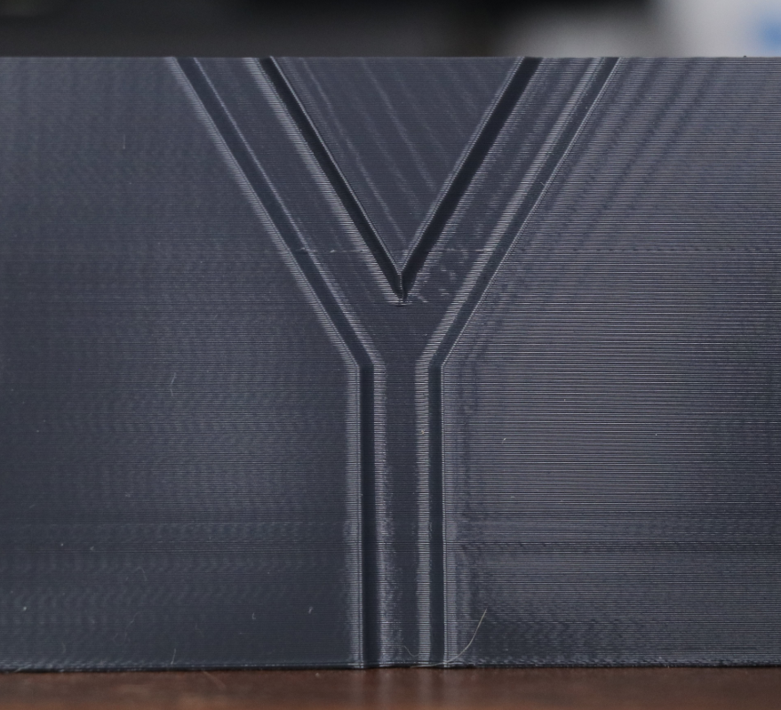
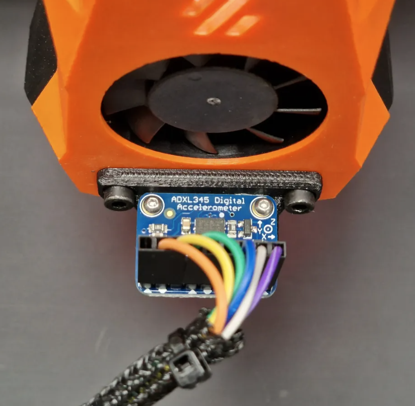
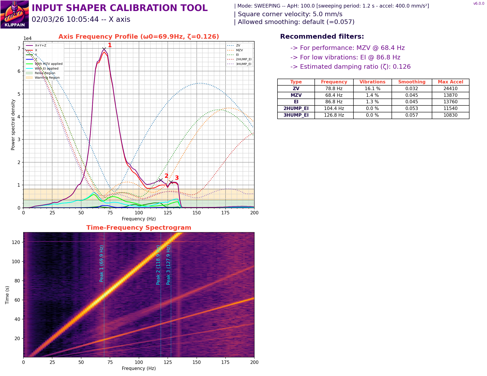
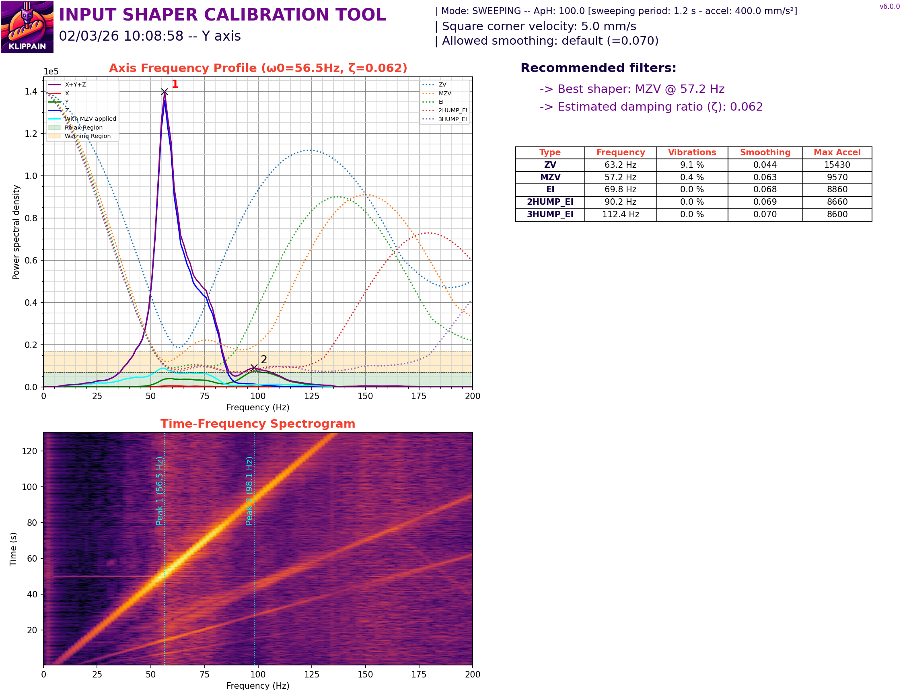
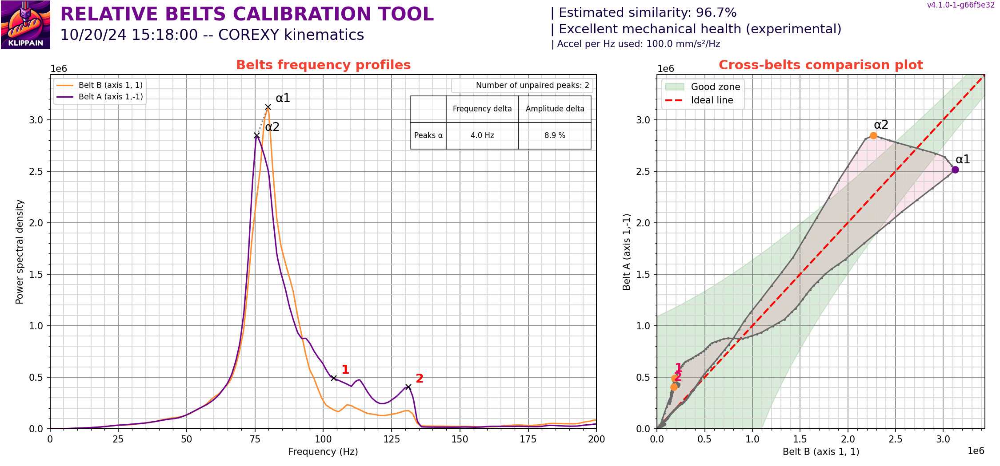

# Input Shaping — Klipper Resonance Compensation

> Eliminate ringing, ghosting, and echoing artefacts from your prints by measuring and cancelling frame vibration with Klipper's built-in resonance testing tools.

---

## What Is Ringing?

Ringing (also called ghosting or echoing) appears as rippling waves in the print surface, usually radiating outward from sharp corners and direction changes. It is caused by the printer frame vibrating when the toolhead changes direction rapidly. Those vibrations get recorded into the plastic layer by layer.


*Ringing artefact — the rippling pattern near the corner is caused by frame resonance. Input shaping eliminates this.*

Input shaping works by measuring the resonant frequencies of your specific printer, then applying a digital filter that pre-cancels those vibrations before they reach the steppers. The result is clean, ringing-free output at higher speeds.

---

## What You Need

| Item | Notes |
|---|---|
| ADXL345 accelerometer | ~£3–£5 from any electronics supplier. The standard choice for Klipper. |
| Raspberry Pi or Klipper host | The accelerometer connects to the Pi via SPI — built-in on all Pi models |
| Klipper + Mainsail or Fluidd | Any recent Klipper version supports `TEST_RESONANCES` and `SHAPER_CALIBRATE` |
| `numpy` installed on the Pi | Required for graph generation — installed once via SSH |

> 💡 Some toolhead boards (e.g. EBB36, Mellow Fly SHT) have an ADXL345 built in — if yours does, skip the wiring step.

---

## Step 1 — Install numpy on Your Pi

Connect to your Pi via SSH and run:

```bash
~/klippy-env/bin/pip install numpy
```

This only needs to be done once. Restart Klipper after installing:

```bash
sudo systemctl restart klipper
```

---

## Step 2 — Wire the ADXL345

The ADXL345 connects to the Raspberry Pi's SPI bus:

| ADXL345 Pin | Raspberry Pi Pin | GPIO |
|---|---|---|
| VCC | 3.3V | Pin 1 |
| GND | GND | Pin 6 |
| CS | CE0 | GPIO 8 (Pin 24) |
| SDO/MISO | MISO | GPIO 9 (Pin 21) |
| SDA/MOSI | MOSI | GPIO 10 (Pin 19) |
| SCL/CLK | SCLK | GPIO 11 (Pin 23) |


*ADXL345 mounted rigidly to the toolhead. Use the hotend fan screws or a printed mount — it must not wobble at all.*

> ⚠️ **Rigid mounting is critical.** Any movement between the sensor and the toolhead produces false readings. Use screws, not tape.

For the **Y axis measurement**, remount the accelerometer to the bed (on a flat spot near the centre). You are measuring the bed's resonant frequency, not the toolhead's.

---

## Step 3 — Add to printer.cfg

Add the following sections to your `printer.cfg`. The `probe_points` should be set to the centre of your build plate:

```ini
[mcu rpi]
serial: /tmp/klipper_host_mcu

[adxl345]
cs_pin: rpi:None

[resonance_tester]
accel_chip: adxl345
probe_points:
    150, 150, 20  # adjust to your bed centre — X, Y, Z height
accel_per_hz: 75  # default — see below
```

Save and do a **firmware restart** from Mainsail or Fluidd before proceeding.

---

### accel_per_hz — What It Is and When to Change It

`accel_per_hz` controls how hard the printer accelerates at each frequency step during the resonance sweep. Klipper multiplies this value by the current test frequency to calculate the acceleration used at that point:

```
acceleration at each step = accel_per_hz × frequency
```

So with the default of `75` at a test frequency of `50 Hz`, the printer accelerates at `75 × 50 = 3750 mm/s²`. At `100 Hz` it would use `7500 mm/s²`. The higher the frequency being tested, the more force is applied to the frame.

**The default of `75` is suitable for most printers.** You only need to change it in specific situations:

| Situation | Adjustment | Value |
|---|---|---|
| Graph peaks are unclear, noisy, or hard to read | Increase — stronger signal makes peaks sharper | `100` – `150` |
| Printer is rattling violently or objects falling off during the test | Decrease — reduces forces applied | `50` – `60` |
| Heavy bed-slinger or large enclosed printer with high moving mass | Increase — heavier systems need more force to excite resonance | `100` – `125` |
| Lightweight CoreXY with a stiff frame | Default is usually fine | `75` |
| Printer has very low resonant frequency (< 25 Hz) | Decrease — the test applies very high force at low frequencies | `50` |

> ⚠️ Setting `accel_per_hz` too high on a lightweight or poorly-anchored printer can cause it to move across the bench during the sweep, or stress belts and joints. If the printer is moving noticeably, reduce the value.

Example with a higher value for a heavy or noisy system:

```ini
[resonance_tester]
accel_chip: adxl345
probe_points:
    150, 150, 20
accel_per_hz: 100
```

---

## Step 4 — Run the Resonance Tests

From the Mainsail / Fluidd console, run each axis test separately:

```gcode
TEST_RESONANCES AXIS=X
TEST_RESONANCES AXIS=Y
```

Klipper will move the toolhead through a resonance sweep for each axis and write the results to `/tmp/` on the Pi. You will see output like:

```
Resonance measurements:
X: Fitted shaper 'mzv' frequency = 68.4 Hz (vibrations = 1.4%, smoothing ~= 0.045)
Y: Fitted shaper 'mzv' frequency = 57.2 Hz (vibrations = 0.4%, smoothing ~= 0.063)
```

To generate the frequency graphs, run:

```bash
~/klipper/scripts/calibrate_shaper.py /tmp/resonances_x_*.csv -o /tmp/shaper_calibrate_x.png
~/klipper/scripts/calibrate_shaper.py /tmp/resonances_y_*.csv -o /tmp/shaper_calibrate_y.png
```

Then copy the `.png` files to your computer to view them (via WinSCP, FileZilla, or `scp`).

---

## Step 5 — Read Your Graphs

### X Axis — Resonance Graph


*X axis result — recommended shaper: MZV @ 68.4 Hz | Damping ratio ζ = 0.126 | Smoothing = 0.045*

---

### Y Axis — Resonance Graph


*Y axis result — recommended shaper: MZV @ 57.2 Hz | Damping ratio ζ = 0.062 | Smoothing = 0.063*

---

### How to Read the Graph

The graph shows vibration amplitude (Y axis) against frequency (X axis) for each available shaper type. What to look for:

- **The recommended shaper is highlighted** — Klipper picks the best balance between vibration reduction and smoothing
- **Lower vibration % = better** — aim for under 5% if possible
- **Smoothing value** — higher smoothing reduces ringing more but softens fine detail at high speeds; lower smoothing preserves detail
- **The peak frequency** is where your printer resonates most — this is the number that goes into `printer.cfg`

---

## Step 6 — Apply to printer.cfg

Use the values from your test output to fill in the `[input_shaper]` section. Add this to your `printer.cfg`:

```ini
[input_shaper]
shaper_freq_x: 68.4         # MZV recommended for X — from calibration graph
shaper_freq_y: 57.2         # MZV recommended for Y — from calibration graph
shaper_type_x: mzv
shaper_type_y: mzv
damping_ratio_x: 0.126      # ζ value from X axis graph (provided by Shake&Tune)
damping_ratio_y: 0.062      # ζ value from Y axis graph (provided by Shake&Tune)
```

> 💡 You can use different shaper types for X and Y — Klipper supports `shaper_type_x` and `shaper_type_y` independently. Use `shaper_type` only if both axes use the same type.

Save `printer.cfg` and do a **firmware restart**.

### Example — completed section:

> 📸 **[Placeholder — add a screenshot of your printer.cfg input_shaper section here]**
>
> *Show the completed `[input_shaper]` block with your real values filled in.*

---

## Understanding Smoothing

Smoothing is the trade-off at the heart of input shaping. Every shaper filter that reduces ringing also introduces a small amount of smoothing — a slight softening of fine surface detail at high speeds. The stronger the filter, the more smoothing it applies.

### What the smoothing value means

When Klipper reports a result like:

```
X: Fitted shaper 'mzv' frequency = 68.4 Hz (vibrations = 1.4%, smoothing ~= 0.045)
```

The `smoothing ~= 0.047` figure tells you how much the filter rounds off sharp features. As a rough guide:

| Smoothing Value | Effect on Print Quality |
|---|---|
| < 0.05 | Minimal — virtually no visible impact at normal speeds |
| 0.05 – 0.10 | Slight — fine detail may soften slightly at very high speeds |
| 0.10 – 0.15 | Moderate — noticeable at high speeds; reduce speed if detail matters |
| > 0.15 | High — significant softening; switch to a less aggressive shaper or reduce speed |

Lower is better, but a higher smoothing value is still preferable to ringing. If your smoothing is high, consider:
1. Trying a less aggressive shaper type (e.g. `mzv` instead of `ei`)
2. Reducing print speed rather than changing the shaper
3. Addressing the mechanical cause — loose belts or a resonant frame

---

### damping_ratio_x and damping_ratio_y

These values tell Klipper how damped your printer's vibrations are — how quickly the frame naturally stops ringing after a direction change. Rather than estimating these values, **Klippain Shake&Tune measures and reports the exact damping ratio for each axis directly on the calibration graph** (shown as ζ). Use the values from your graphs rather than guessing.

---

### Controlling Smoothing When Using SHAPER_CALIBRATE

When running the automatic calibration, you can set a maximum acceptable smoothing limit. Klipper will then only recommend shapers that stay within that limit:

```gcode
SHAPER_CALIBRATE MAX_SMOOTHING=0.05
```

This is useful if you find the auto-selected shaper produces more softening than you want on detailed prints. Setting a lower `MAX_SMOOTHING` forces Klipper to pick a less aggressive shaper — but if ringing is not fully eliminated, lower it further only in small steps.

A good starting point:

| Print Focus | Suggested MAX_SMOOTHING |
|---|---|
| Speed priority | 0.10 – 0.15 (default — let Klipper decide) |
| Balanced | 0.06 – 0.08 |
| Fine detail priority | 0.04 – 0.05 |

---

## Shaper Types Reference

| Shaper | Characteristics | Best For |
|---|---|---|
| `zv` | Least smoothing, fastest | Low resonance frequencies, very stiff frames |
| `mzv` | Good balance — Klipper's most common recommendation | Most printers — well-tuned CoreXY and bed-slingers |
| `ei` | More smoothing than MZV | Higher resonance frequencies |
| `2hump_ei` | Aggressive smoothing | Printers with poorly-controlled or very high frequencies |
| `3hump_ei` | Maximum smoothing | Last resort — will noticeably reduce print detail |

---

## Or — Let Klipper Do It Automatically

Instead of steps 4–6 above, you can run a single command that tests both axes and writes the values directly into `printer.cfg`:

```gcode
SHAPER_CALIBRATE
```

Klipper runs both sweeps, selects the best shaper and frequency for each axis, and saves the result automatically. After it completes, run `SAVE_CONFIG` and Klipper will restart with the new values applied.

> ⚠️ `SHAPER_CALIBRATE` overwrites any existing `[input_shaper]` values. Review the result in `printer.cfg` after it runs.

---

## Belt Tension Comparison (CoreXY Only)

On a CoreXY printer, two belts work together to move the toolhead — Belt A and Belt B. If these belts are not equally tensioned, or if one has a different resonant frequency to the other, you will get asymmetric ringing, inconsistent motion, and poor input shaper results. Checking belt balance before running `SHAPER_CALIBRATE` is strongly recommended.

> ℹ️ This section applies to **CoreXY and similar kinematic systems** (e.g. CoreXZ, Annex, Hevort). Bed-slinger printers (Ender, Prusa etc.) have independent X and Y belts and do not need this comparison.

---

### How to Run Belt Comparison

Belt comparison is provided by the **[Klippain Shake&Tune](https://github.com/Frix-x/klippain-shaketune)** plugin. Once installed, run the following macro from your Mainsail or Fluidd console:

```gcode
BELTS_SHAPER_CALIBRATION
```

The tool uses the ADXL345 to sweep both belt paths and generates a comparison graph saved to your Pi. The macro must be run with the ADXL345 mounted to the toolhead.

---

### Reading the Belt Comparison Graph


*Belt comparison output from Klippain Shake&Tune — 96.7% similarity indicates excellent mechanical balance between both belts.*

The graph has two panels:

**Left — Belts Frequency Profiles**
Shows the resonance frequency curve for Belt A and Belt B overlaid on the same plot. Ideally both curves sit almost exactly on top of each other — same peak frequency, same amplitude. Any gap between the curves indicates an imbalance.

**Right — Cross-Belts Comparison Plot**
Plots Belt A power against Belt B power at each frequency. A perfectly balanced pair produces a straight diagonal line exactly on the ideal line (dashed red). Points falling off the line in either direction indicate tension or resonance imbalance.

The green shaded zone is the acceptable region. As long as the majority of the curve sits inside the green zone, your belts are well matched.

---

### What the Numbers Mean

| Metric | What It Measures | Target |
|---|---|---|
| **Estimated similarity** | Overall match between both belt curves | > 95% — excellent; 90–95% — acceptable; < 90% — retension |
| **Frequency delta** | Difference in peak resonant frequency between A and B | < 5 Hz ideal; < 10 Hz acceptable |
| **Amplitude delta** | Difference in peak vibration amplitude between A and B | < 10% ideal |
| **Mechanical health** | Shake&Tune's overall assessment | Aim for "Good" or "Excellent" |

The example graph above shows:
- **Similarity: 96.7%** — excellent balance
- **Frequency delta: 8.0 Hz** — acceptable, minor tension difference
- **Amplitude delta: 9.9%** — within acceptable range
- **Mechanical health: Excellent**

---

### What to Do If Belts Are Out of Balance

If similarity is below 95% or the frequency delta is large:

1. **Check belt tension on both A and B** — use a tension meter or the Gates Carbon Drive app for a consistent reference. Both belts should have the same tension in grams.
2. **Check for tight spots** — run the belt manually through its full travel. It should move smoothly with no stiff sections.
3. **Check for worn or cracked belt teeth** — a damaged belt will have irregular frequency response.
4. **Check pulleys and idlers** — a loose grub screw on a pulley will cause one belt path to behave inconsistently.
5. **Re-run `BELTS_SHAPER_CALIBRATION`** after any adjustment and compare the new graph.

> 💡 Get belt tension as close as possible before running `SHAPER_CALIBRATE` for input shaping. The input shaper result is only as good as the mechanical state of the printer at the time of measurement.

---

## Tips

- **Fix mechanical issues first** — input shaping cannot compensate for loose belts, worn bearings, or a wobbly frame. Those must be resolved before calibration.
- **Equal belt tension matters** — uneven belt tension on X and Y will give inconsistent results. Tension both belts before running the test.
- **Re-run calibration after any physical change** — changing the hotend, adding a camera, replacing the bed, moving the printer, or adding a spool holder all change the resonant frequency.
- **Higher frequency = stiffer printer** — a well-built CoreXY typically measures 60–100 Hz on X/Y. A bed-slinger often measures 30–50 Hz.
- **After calibration, increase your print speed** — input shaping allows significantly higher speeds without ringing. Test with a speed tower after applying the shaper.
- **The accelerometer stays on during normal printing** — there is no need to remove it. It is only active during resonance tests.

---

*Back to [Tuning Guides](../README.md#tuning-guides) | [README](../README.md)*
