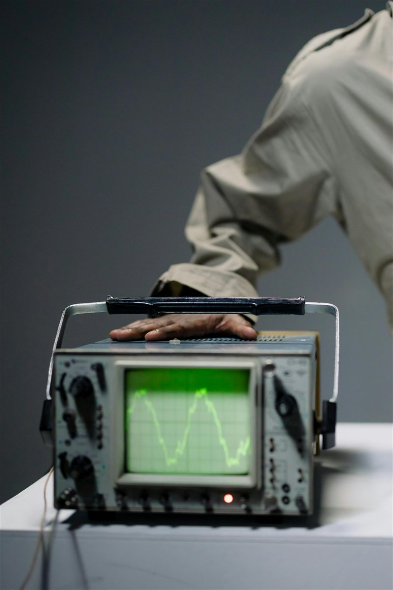

# Input Shaping / Resonance Compensation

> Eliminate ringing, ghosting, and echoing artefacts caused by vibration in your printer frame.

---

## Overview

Ringing (also called ghosting or echoing) appears as rippling waves in the print surface near sharp corners and direction changes. It is caused by resonance in the printer frame — when the printhead changes direction rapidly, the frame vibrates, and those vibrations are recorded in the plastic. Input shaping measures those vibrations and applies a filter to cancel them out.

*Ringing artefact — the rippling pattern near the corner is caused by frame resonance.*

---

## Methods by Printer Type

| Printer | Method |
|---|---|
| Bambu X1/P1 series | Built-in vibration compensation — run from touchscreen |
| Klipper | ADXL345 accelerometer + automatic resonance measurement |
| Marlin | Manual frequency estimation or accelerometer with external tools |

---

## Bambu — Built-In Calibration

Bambu printers handle input shaping automatically:

1. On the touchscreen go to **Settings > Calibration > Vibration Compensation**
2. The printer runs a resonance sweep automatically
3. Results are applied immediately — no manual input needed

Re-run after any physical change to the printer (new bed, changed hotend, moved position).

*Bambu calibration menu — vibration compensation runs a full sweep automatically.*

---

## Klipper — ADXL345 Accelerometer Method

### Hardware Required
- ADXL345 accelerometer module (~£3)
- Connection to your Klipper host (Raspberry Pi or similar) via SPI

### Step 1 — Mount the Accelerometer

Mount the ADXL345 firmly to the printhead (for X-axis) and the bed (for Y-axis). It must be rigidly attached — any movement between the sensor and the mount invalidates the measurement.

*ADXL345 mounted rigidly to the toolhead — use the same screws as the printhead fan or shroud.*

### Step 2 — Configure printer.cfg

Add to your printer.cfg:

`ini\n[adxl345]\ncs_pin: rpi:None\n\n[resonance_tester]\naccel_chip: adxl345\nprobe_points:\n    150, 150, 20\n`\n
### Step 3 — Run the Test

From the Klipper console or Mainsail/Fluidd:

`\nTEST_RESONANCES AXIS=X\nTEST_RESONANCES AXIS=Y\n`\n
Klipper measures resonance frequencies and generates a frequency graph.

*Resonance graph generated by Klipper — the peak frequency is used to configure the shaper.*

### Step 4 — Apply the Shaper

Run the automatic shaper recommendation:

`\nSHAPER_CALIBRATE\n`\n
Klipper will recommend a shaper type and frequency. Add to printer.cfg:

`ini\n[input_shaper]\nshaper_freq_x: 48.2\nshaper_freq_y: 44.6\nshaper_type: mzv\n`\n
### Common Shaper Types

| Shaper | Best For |
|---|---|
| ZV | Low resonance frequency, max speed |
| MZV | Good balance of smoothing and speed |
| EI | Higher resonance frequencies |
| 2HUMP_EI | Very high frequency or poorly-tuned printers |

---

## Marlin — Manual Method

Without an accelerometer you can estimate the resonance frequency visually:

1. Print a ringing test object (cube with sharp corners at high speed)
2. Count the number of ripple waves and measure the distance they span
3. Calculate frequency: **f = print_speed / ripple_spacing**
4. Enable input shaping in Marlin firmware and set the frequency

This is less accurate than the accelerometer method but better than nothing.

---

## Tips

- Input shaping allows you to **print faster without ringing** — after calibration, speed can often be increased significantly.
- Re-run calibration if you: add a spool holder, change the bed, move the printer, or change the hotend weight.
- Input shaping cannot fix ringing caused by **loose belts or worn bearings** — fix mechanical issues first.
- Check belt tension before running calibration — equal tension on X and Y belts is important.

---

*Back to [Tuning Guides](../README.md#tuning-guides) | [README](../README.md)*