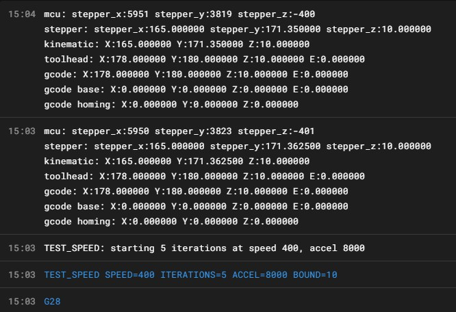

# Maximum Speed & Acceleration

> **Difficulty:** ⭐⭐⭐ Intermediate | **Firmware:** Klipper | **Do this after:** Input shaping and belt tension are sorted — mechanical accuracy before speed

---

## Before You Start

Finding your printer's absolute maximum speed is satisfying — but the number you land on in testing is not the number you should print at. There's always a margin between "the printer won't skip steps" and "the printer produces good prints at this speed." Expect to back off 10–20% from your tested maximum for real print settings.

Also: input shaping comes first. Shaping raises the practical speed ceiling by reducing ringing — there's no point finding a speed maximum on a printer that's still fighting resonance.

---

## The Method — Acceleration First, Speed Second

Getting the order right matters. Acceleration is the harder limit to hit cleanly because it stresses the motors harder during direction changes. Find that limit first, then work up to speeds within the range acceleration allows.

### Phase 1 — Maximum Acceleration

Use the `TEST_SPEED` macro (see [Utility Macros](../macros/Utilities.md)) with a fixed moderate speed and escalating acceleration. The macro is available from the Ellis3DP Print Tuning Guide macros repository:

**[→ TEST_SPEED macro source — Ellis3DP GitHub](https://github.com/AndrewEllis93/Print-Tuning-Guide/tree/main/macros)**

```gcode
TEST_SPEED SPEED=300 ACCEL=3000 ITERATIONS=5
TEST_SPEED SPEED=300 ACCEL=5000 ITERATIONS=5
TEST_SPEED SPEED=300 ACCEL=7000 ITERATIONS=5
TEST_SPEED SPEED=300 ACCEL=10000 ITERATIONS=5
```

Start with 5 iterations for a quick check. Once you've found a rough ceiling — a value where you hear or see something wrong — drop back below it and retest with 50 iterations to confirm stability:

```gcode
TEST_SPEED SPEED=300 ACCEL=8000 ITERATIONS=50
```

### Phase 2 — Maximum Speed

Once you have a stable acceleration ceiling, hold accel at a safe value slightly below that ceiling and push speed:

```gcode
TEST_SPEED SPEED=400 ACCEL=8000 ITERATIONS=5
TEST_SPEED SPEED=500 ACCEL=8000 ITERATIONS=5
TEST_SPEED SPEED=600 ACCEL=8000 ITERATIONS=5
```

Again — rough maximum with 5 iterations, then confirm your final value with 50 iterations.

> ⚠️ **Run tests at real printing conditions.** For enclosed printers, let the chamber heat soak fully before testing. A cold chamber has less belt resistance than a hot one — a limit found cold may not hold when the printer has been running for an hour.

---

## How to Know When You've Hit the Limit

### Audible / Visual Signs

- **Clunking or grinding** — steppers skipping steps
- **Visible shudder** mid-move
- **Erratic toolhead motion** that doesn't match the commanded pattern

### Terminal Verification (Klipper)

This is the most reliable method. Before starting a test run, note the current stepper positions:

```gcode
STEPPER_BUZZ STEPPER=stepper_x   ; optional — just to confirm connection
GET_POSITION
```

After the test completes and the toolhead returns to start:

```gcode
G28 X Y   ; re-home
GET_POSITION
```

Compare the `mcu` position values before and after. The acceptable variance depends on your microstep setting — with `microsteps: 16` the tolerance window is ±16 counts. If the difference is larger than your microstep count, the printer lost steps during the run.



*Real-world result — `TEST_SPEED SPEED=400 ACCEL=8000 ITERATIONS=5 BOUND=10` completed without losing steps. Before the run: X `5950`, Y `3823`. After re-homing: X `5951`, Y `3819`. The difference is 1 count on X and 4 counts on Y — both well within the ±16 microstep tolerance of a 16-microstep configuration. This confirms 400 mm/s at 8000 mm/s² accel is fully stable on this machine.*

---

## Motor Type Affects Your Ceiling

| Motor | Typical Max Speed |
|---|---|
| 1.8° steppers | 800–1000 mm/s theoretical |
| 0.9° steppers | 400–500 mm/s typical |

0.9° motors have twice as many steps per revolution — which means they need twice the step rate to reach the same speed. Most Klipper printers using 0.9° motors will hit a firmware or driver stepping ceiling well before any mechanical limit.

Higher supply voltage (24V vs 12V) helps — the motor coils energise faster, maintaining torque at higher speeds.

---

## Applying Your Results

Once you have confirmed maximums, apply them in `printer.cfg`:

```ini
[printer]
max_velocity: 450        ; tested maximum minus ~15%
max_accel: 7000          ; tested maximum minus ~15%
```

For per-print overrides in the slicer, you can set different speeds for perimeters, infill, and travels. Infill can usually run at or near the volumetric limit. Perimeters and walls should run slower for surface quality. Travels can often run at the full tested maximum since they don't involve extrusion.

> 💡 **The real printing speed ceiling is usually your volumetric flow limit**, not your motion limit. See [Max Volumetric Flow Rate](Max-Volumetric-Flow.md) — a fast motion system running a slow hotend still prints slowly. Find both limits and they'll tell you your actual practical ceiling.

---

## Typical Results for Common Printer Types

| Printer Type | Realistic Print Speed | Max Accel |
|---|---|---|
| Cartesian (bed-slinger) | 80–120 mm/s | 1500–3000 mm/s² |
| CoreXY (stock, Ender-style) | 150–250 mm/s | 3000–6000 mm/s² |
| Voron 2.4 / Trident (well-tuned) | 250–400 mm/s | 6000–12000 mm/s² |
| High-speed CoreXY (Bambu-class) | 400–600 mm/s | 10000–20000 mm/s² |

These are real-world print speeds — not travel speeds or short-burst peaks.

---

## Common Problems

| Problem | Likely Cause | Fix |
|---|---|---|
| Printer skips at surprisingly low speeds | Input shaping not done, or belts too loose/tight | Tune input shaping first, check belt tension |
| Results are inconsistent run to run | Chamber not heat-soaked, or driver temps fluctuating | Let printer fully warm up, check TMC driver cooling |
| Position drifts but no audible skipping | Endstop/probe repeatability issue masking the result | Take multiple `GET_POSITION` readings before concluding |
| Speed limit well below expectations | Volumetric flow is the actual bottleneck | Check hotend flow capacity — see Max Volumetric Flow guide |

---

*Back to [Tuning Guides](../README.md#-tuning-guides) | [README](../README.md)*
