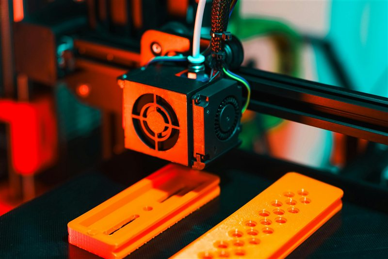

# Pressure Advance Calibration

> Eliminate bulging corners, blobs at direction changes, and rounded details caused by pressure lag in the hotend.

---

## Overview

Pressure Advance (Klipper) and Linear Advance (Marlin) compensate for the pressure buildup and bleed-off inside the hotend as the printer accelerates and decelerates. Without it, corners bulge outward and fine details are rounded. It is one of the highest-impact calibrations you can do.

OrcaSlicer has a built-in PA calibration print — no external tools needed.

---

## What You Need

- Orca Slicer
- A well-tuned first layer and correct flow ratio (calibrate those first)
- ~20 minutes

---

## Step 1 — Open the Calibration Tool

In Orca Slicer go to **Calibration > Pressure Advance**.

*Calibration > Pressure Advance in Orca Slicer.*

---

## Step 2 — Configure the Test

OrcaSlicer will generate a line pattern. Each line is printed at a different PA value, printed as a label alongside it.

- Set **Start value**: 0
- Set **End value**: 0.1 (direct drive) or 1.0 (Bowden)
- Set **Step**: 0.005 (direct drive) or 0.05 (Bowden)
- Leave print speed at default

*PA test configuration — adjust range for your extruder type.*

---

## Step 3 — Print and Read the Pattern

Print the pattern. Examine the lines — you are looking for the line where the corners are **sharpest and squarest** without being pinched or over-compressed.

| What You See | Meaning |
|---|---|
| Bulging, rounded corners | PA value too low — increase |
| Pinched, thin corners | PA value too high — decrease |
| Sharp, square corners, even line width | Correct PA value |

*The printed pattern — find the line with the sharpest corners and most even line width.*

*Left: PA too low (bulging). Centre: correct. Right: PA too high (pinched).*

---

## Step 4 — Apply the Value

**Klipper:** Add or update in your printer.cfg:
`\npressure_advance: 0.045\n`\n
Or set it per-filament in Orca Slicer under **Filament Settings > Filament > Pressure advance**.

**Marlin (Linear Advance):** Set in firmware or send via G-code:
`\nM900 K0.045\n`\n
**Bambu:** PA is handled automatically — Orca Slicer sends it per filament profile.

---

## Tips

- PA is **per filament AND per print speed** — a value tuned at 60 mm/s may need adjusting at 150 mm/s.
- Recalibrate when switching between **flexible and rigid** materials — TPU needs very different values.
- If you change hotend, nozzle size, or extruder, recalibrate from scratch.
- A PA value of 0 is valid for some direct-drive setups with very short melt zones.

### Typical Starting Ranges

| Setup | Typical PA Range |
|---|---|
| Direct drive (E3D, Dragon, Revo) | 0.02–0.08 |
| Bowden (Ender 3 stock) | 0.4–0.8 |
| Bambu X1/P1 | Managed automatically |

---

*Back to [Tuning Guides](../README.md#tuning-guides) | [README](../README.md)*