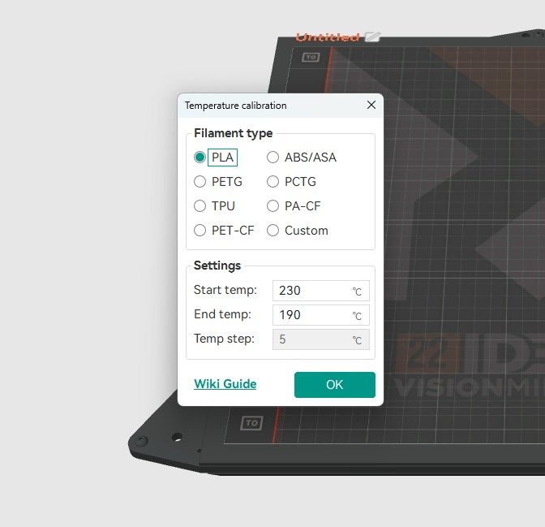
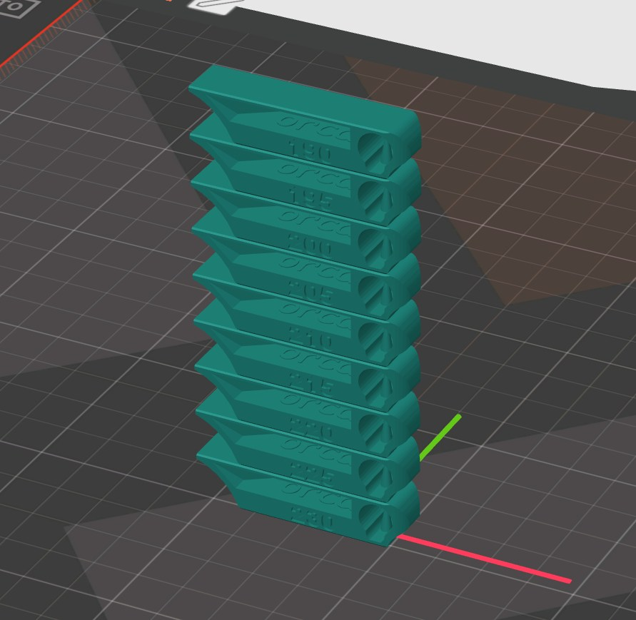
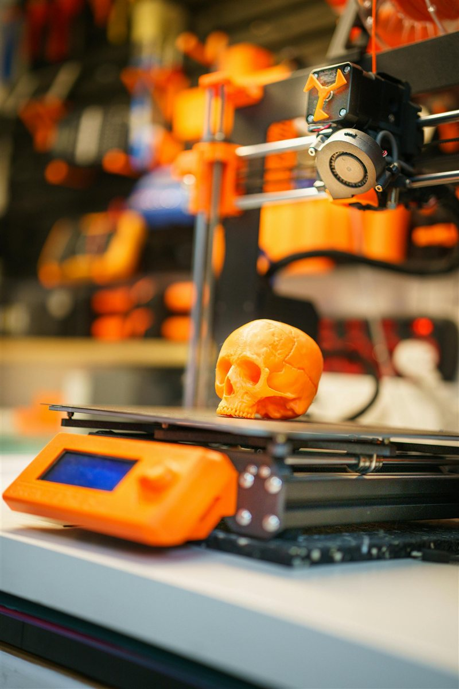

# Temperature Tower

> Find the ideal printing temperature for any filament in a single print.

---

## Overview

A temperature tower prints the same geometry repeatedly at different nozzle temperatures, stepping down (or up) in 5°C increments. By examining each zone you can identify the best temperature for bridging, overhangs, layer adhesion, stringing, and surface quality — all in one print.

---

## What You Need

- Orca Slicer (has a built-in temperature tower calibration)
- Your filament loaded and a basic profile set up
- ~30 minutes print time

---

## Step 1 — Open the Calibration Tool

In Orca Slicer go to **Calibration > Temperature** from the top menu.

OrcaSlicer will generate the tower model automatically — no external file needed.

*Calibration menu in Orca Slicer — select Temperature.*

---

## Step 2 — Set Your Temperature Range

Enter the start and end temperatures for your material. Use the ranges below as a guide:

| Material | Suggested Range |
|---|---|
| PLA | 190–230°C |
| PETG | 225–250°C |
| ABS / ASA | 230–255°C |
| TPU | 215–240°C |
| Nylon | 240–270°C |

Set the **step** to 5°C. The tower will print a new zone every 5°C.

*Set your start temp, end temp, and step size.*

---

## Step 3 — Slice and Print

OrcaSlicer inserts temperature change G-code automatically at each zone boundary. Slice and send to printer.

*Sliced tower — each band represents a 5°C step.*

---

## Step 4 — Assess Each Zone

Once printed, examine each zone for the following:

| Feature | What to Look For |
|---|---|
| Bridging | Cleanest, flattest bridge with least sag |
| Overhangs | Sharpest overhang edges without curling |
| Stringing | Least stringing between pillars |
| Layer adhesion | No delamination, good layer bonding |
| Surface quality | Smoothest walls, least banding |

The best temperature is usually a compromise — pick the zone where **bridging, overhangs, and stringing** all look good together.

*Each zone on the printed tower corresponds to a specific temperature — read from top (coolest) to bottom (hottest).*

*Detail comparison between zones — note how stringing and bridge quality change with temperature.*

---

## Tips

- Run a temperature tower for **every new brand or colour** — same material type can vary significantly between manufacturers.
- If all zones look the same, your range may be too narrow — widen it by 10°C on each end.
- **High temperatures** = better layer adhesion, more stringing, rougher surface.
- **Low temperatures** = less stringing, cleaner overhangs, risk of poor layer adhesion and clogging.
- Once you find the ideal zone, **update the temperature in your filament profile** in Orca Slicer.

---

*Back to [Tuning Guides](../README.md#tuning-guides) | [README](../README.md)*